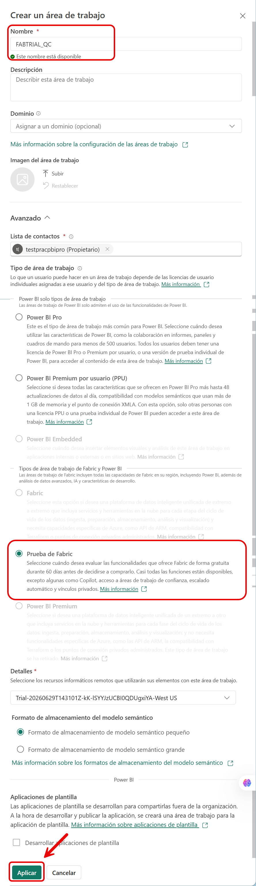
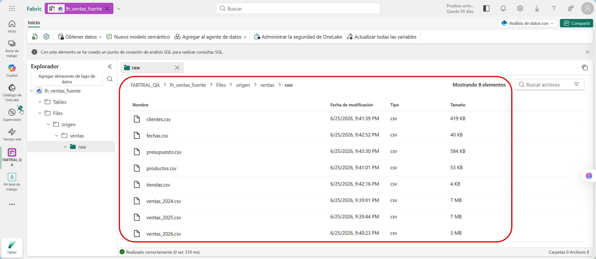
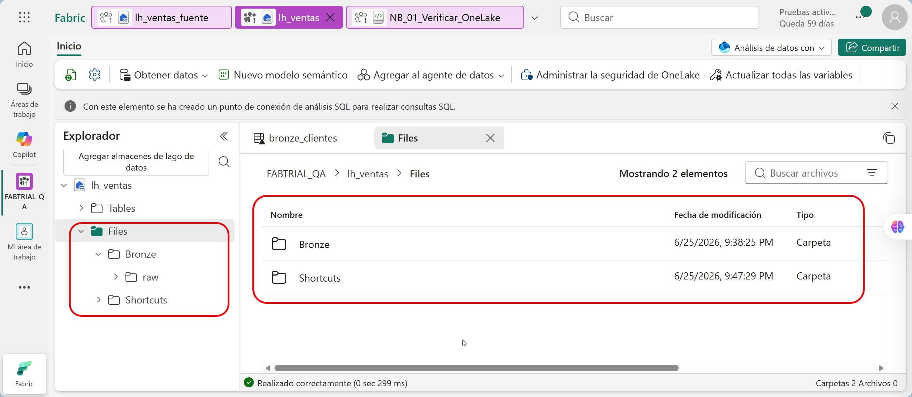
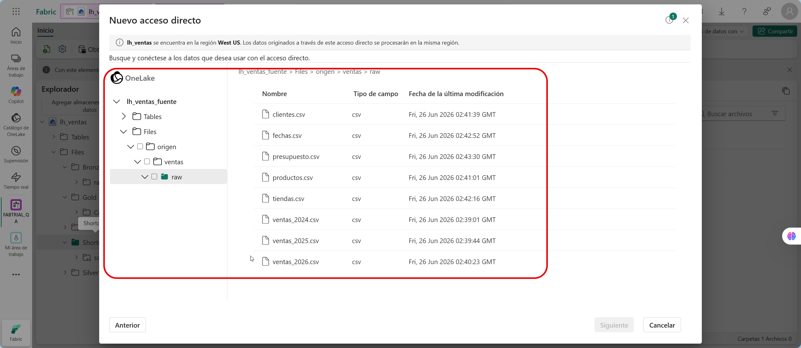
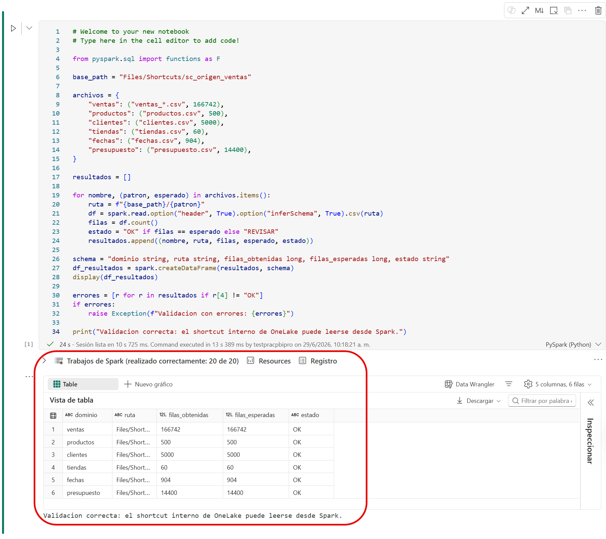

# Configuración de Lakehouse y conectividad mediante Shortcuts de OneLake

---

## 1. Metadatos

| Atributo | Detalle |
|---|---|
| **Duración estimada** | 75 minutos |
| **Complejidad** | Media |
| **Nivel Bloom** | Aplicar (*Apply*) |
| **Módulo** | Capítulo 1 - Fundamentos de Arquitectura en Fabric y OneLake |
| **Dependencias** | Ninguna. Es el primer laboratorio de la serie. |
| **Produce artefactos para** | Capítulos 2, 3, 4 y 5 |

---

## 2. Descripción general

En este laboratorio configurarás los cimientos de la arquitectura de datos del curso. Crearás un workspace de Microsoft Fabric con capacidad Trial, aprovisionarás dos Lakehouses y cargarás los datos del taller directamente en OneLake.

Trabajarás con un Lakehouse de origen llamado `lh_ventas_fuente`, donde quedarán los archivos CSV del taller, y un Lakehouse analítico llamado `lh_ventas`, donde se construirá la arquitectura Medallion de los siguientes capítulos.

También crearás un **shortcut interno de OneLake** para exponer los archivos del Lakehouse de origen desde el Lakehouse principal. Con esto comprobarás cómo OneLake permite acceder a datos entre artefactos de Fabric sin duplicar archivos manualmente.

> **Dependencia crítica:** no elimines el workspace, los lakehouses, el shortcut ni los archivos cargados. Todos los laboratorios posteriores dependen de ellos.

---

## 3. Objetivos de aprendizaje

Al completar este laboratorio serás capaz de:

- Crear un workspace de Microsoft Fabric asociado a Trial.
- Crear un Lakehouse de origen para almacenar archivos CSV en OneLake.
- Crear un Lakehouse principal para implementar la arquitectura Medallion.
- Cargar archivos CSV del taller en la zona de origen de OneLake.
- Crear carpetas `Bronze` y `Shortcuts` en el Lakehouse principal.
- Crear un shortcut interno de OneLake desde `lh_ventas` hacia `lh_ventas_fuente`.
- Validar el acceso a los archivos mediante un notebook de Fabric.
- Documentar la configuración base que se usará en los demás capítulos.

---

## 4. Prerrequisitos

### 4.1 Conocimientos previos

| Área | Nivel requerido |
|---|---|
| Navegación en Microsoft Fabric | Básico |
| Conceptos de Data Lake | Básico |
| Conceptos de arquitectura Medallion | Conceptual |
| SQL básico | Básico |
| Notebooks / PySpark | Deseable, no obligatorio |

### 4.2 Acceso requerido

| Recurso | Detalle |
|---|---|
| Cuenta | Cuenta organizacional Microsoft Entra ID. |
| Licencia | Power BI Pro y Fabric Trial activo. |
| Permisos | Crear workspace o rol Contributor/Member en un workspace de práctica. |
| Navegador | Microsoft Edge o Google Chrome actualizado. |
| Datos | Carpeta `datos/raw` incluida en este repositorio. |

### 4.3 Material del laboratorio

Antes de iniciar confirma que tienes acceso a la carpeta `datos/raw` del repositorio. Esa carpeta contiene los ocho archivos CSV que se cargarán en OneLake durante este capítulo.

---

## 5. Convenciones obligatorias del laboratorio

Usa los nombres exactos de esta tabla para evitar errores en los capítulos siguientes.

| Artefacto | Nombre |
|---|---|
| Workspace | `FABTRIAL_<alias>` |
| Lakehouse de origen | `lh_ventas_fuente` |
| Lakehouse principal | `lh_ventas` |
| Shortcut | `sc_origen_ventas` |
| Notebook de validación | `NB_01_Verificar_OneLake` |
| Carpeta de origen | `Files/origen/ventas/raw` |
| Carpeta de shortcut | `Files/Shortcuts/sc_origen_ventas` |
| Carpeta Bronze | `Files/Bronze/raw` |
| Carpeta Silver | `Files/Silver` |
| Carpeta Gold | `Files/Gold` |

> Sustituye `<alias>` por tus iniciales o usuario corto. Ejemplo: `FABTRIAL_JL`.

---

## 6. Arquitectura que construirás

```text
Workspace: FABTRIAL_<alias>

lh_ventas_fuente
└── Files
    └── origen
        └── ventas
            └── raw
                ├── ventas_2024.csv
                ├── ventas_2025.csv
                ├── ventas_2026.csv
                ├── productos.csv
                ├── clientes.csv
                ├── tiendas.csv
                ├── fechas.csv
                └── presupuesto.csv

lh_ventas
├── Files
│   ├── Landing
│   ├── Bronze
│   │   └── raw
│   ├── Silver
│   ├── Gold
│   └── Shortcuts
│       └── sc_origen_ventas  ->  lh_ventas_fuente/Files/origen/ventas/raw
└── Tables
    └── vacío al terminar este capítulo
```

---

## 7. Procedimiento paso a paso

---

### Paso 1 - Iniciar sesión y validar acceso a Fabric

**Objetivo:** confirmar que tu cuenta puede acceder a Microsoft Fabric y crear artefactos.

#### Instrucciones

1. Abre Microsoft Edge o Google Chrome.
2. Navega a `https://app.fabric.microsoft.com`.
3. Inicia sesión con la cuenta asignada para el taller.
4. En el menú izquierdo, confirma que puedes ver **Workspaces**.
5. En la esquina superior derecha, abre el menú de tu cuenta.
6. Verifica si aparece una indicación de Trial activo o capacidad Trial disponible.
7. Si Fabric te ofrece iniciar una prueba, selecciona **Start trial** o **Iniciar prueba gratuita**.
8. Espera a que Fabric confirme la activación.

#### Resultado esperado

- Puedes acceder al portal de Fabric.
- No aparece un mensaje de bloqueo por licencia.
- Puedes crear o acceder a un workspace.

#### Validación

Antes de continuar, confirma:

- La sesión está iniciada con la cuenta asignada para el taller.
- Fabric está disponible para crear artefactos.
- Puedes crear o acceder al workspace del curso.

---

### Paso 2 - Crear el workspace del curso

**Objetivo:** crear un contenedor aislado para todos los artefactos del taller.

#### Instrucciones

1. En el menú izquierdo de Fabric, selecciona **Workspaces**.
2. Haz clic en **+ New workspace**.
3. En **Name**, escribe:

   ```text
   FABTRIAL_<alias>
   ```

   Ejemplo:

   ```text
   FABTRIAL_JL
   ```

4. En la sección de licencia o capacidad, selecciona **Trial** si aparece disponible.
5. Deja las demás opciones por defecto.
6. Selecciona **Apply** o **Create**.
7. Espera a que el workspace aparezca en la lista.
8. Abre el workspace recién creado.

   

#### Resultado esperado

El workspace `FABTRIAL_<alias>` existe y está asociado a una capacidad Trial.

#### Validación

1. Dentro del workspace, selecciona **Workspace settings**.
2. Revisa la sección **License info** o **Capacity**.
3. Confirma que el workspace no está en modo Power BI Pro puro, sino asociado a Fabric Trial.

---

### Paso 3 - Crear el Lakehouse de origen `lh_ventas_fuente`

**Objetivo:** crear una ubicación de origen dentro de OneLake para cargar los CSV del curso.

#### Instrucciones

1. Dentro del workspace `FABTRIAL_<alias>`, selecciona **+ New item**.
2. En el buscador, escribe **Lakehouse**.
3. Selecciona **Lakehouse**.
4. En **Name**, escribe exactamente:

   ```text
   lh_ventas_fuente
   ```

5. Selecciona **Create**.
6. Espera a que Fabric aprovisione el Lakehouse.
7. Verifica que el explorador del Lakehouse muestra las secciones **Tables** y **Files**.

#### Resultado esperado

Existe el Lakehouse `lh_ventas_fuente`.

#### Validación

El panel izquierdo del Lakehouse muestra:

```text
Tables
Files
```

Si no aparece **Files**, espera unos segundos y actualiza la página.

---

### Paso 4 - Crear la ruta de origen en OneLake

**Objetivo:** preparar la carpeta donde cargarás los archivos CSV del taller.

#### Instrucciones

1. En `lh_ventas_fuente`, expande **Files**.
2. Haz clic en los tres puntos de **Files** o clic derecho sobre **Files**.
3. Selecciona **New folder**.
4. Crea la carpeta:

   ```text
   origen
   ```

5. Dentro de `origen`, crea la carpeta:

   ```text
   ventas
   ```

6. Dentro de `ventas`, crea la carpeta:

   ```text
   raw
   ```

#### Resultado esperado

La estructura queda así:

```text
lh_ventas_fuente
└── Files
    └── origen
        └── ventas
            └── raw
```

#### Validación

Navega hasta `Files/origen/ventas/raw` y confirma que estás ubicado en una carpeta vacía lista para recibir archivos.

---

### Paso 5 - Cargar los datos del taller en OneLake

**Objetivo:** importar los datos del repositorio hacia el Lakehouse de origen.

#### Instrucciones

1. En tu equipo local, abre la carpeta del repositorio del taller.
2. Ubica la ruta:

   ```text
   datos/raw
   ```

3. Confirma que contiene estos archivos:

   ```text
   ventas_2024.csv
   ventas_2025.csv
   ventas_2026.csv
   productos.csv
   clientes.csv
   tiendas.csv
   fechas.csv
   presupuesto.csv
   ```

4. Regresa a Fabric y asegúrate de estar en:

   ```text
   lh_ventas_fuente > Files > origen > ventas > raw
   ```

5. Selecciona **Upload**.
6. Selecciona **Upload files**.
7. Carga los ocho archivos CSV de `datos/raw`.
8. Espera a que la carga finalice.
9. Si Fabric muestra barra de progreso por archivo, confirma que todos terminan sin error.



#### Resultado esperado

Los ocho archivos CSV aparecen dentro de `Files/origen/ventas/raw`.

#### Validación

Verifica que ves exactamente estos archivos:

| Archivo | Filas esperadas |
|---|---:|
| `ventas_2024.csv` | 67.987 |
| `ventas_2025.csv` | 67.401 |
| `ventas_2026.csv` | 31.354 |
| `productos.csv` | 500 |
| `clientes.csv` | 5.000 |
| `tiendas.csv` | 60 |
| `fechas.csv` | 904 |
| `presupuesto.csv` | 14.400 |

> En este punto solo validas que los archivos existen. Los conteos se validarán con Spark en el paso 10.

---

### Paso 6 - Crear el Lakehouse principal `lh_ventas`

**Objetivo:** crear el Lakehouse donde se implementará la arquitectura Medallion.

#### Instrucciones

1. Regresa al workspace `FABTRIAL_<alias>`.
2. Selecciona **+ New item**.
3. Busca **Lakehouse**.
4. Selecciona **Lakehouse**.
5. En **Name**, escribe exactamente:

   ```text
   lh_ventas
   ```

6. Selecciona **Create**.
7. Espera a que Fabric cree el Lakehouse.

#### Resultado esperado

Existe el Lakehouse `lh_ventas`, separado de `lh_ventas_fuente`.

#### Validación

En el workspace deben verse dos elementos Lakehouse:

```text
lh_ventas_fuente
lh_ventas
```

---

### Paso 7 - Crear la estructura Medallion en `lh_ventas`

**Objetivo:** preparar carpetas de trabajo para Landing, Bronze, Silver y Gold.

#### Instrucciones

1. Abre el Lakehouse `lh_ventas`.
2. Expande **Files**.
3. Crea estas carpetas al mismo nivel dentro de **Files**:

   ```text
   Landing
   Bronze
   Silver
   Gold
   Shortcuts
   ```

4. Dentro de `Bronze`, crea la subcarpeta:

   ```text
   raw
   ```

5. Dentro de `Silver`, crea la subcarpeta:

   ```text
   control
   ```

6. Dentro de `Gold`, crea la subcarpeta:

   ```text
   control
   ```



#### Resultado esperado

La estructura principal queda así:

```text
lh_ventas
└── Files
    ├── Bronze
    │   └── raw
    ├── Shortcuts
```

#### Validación

Confirma que los nombres respetan mayúsculas y minúsculas y que las carpetas están vacías. No agregues archivos todavía.

---

### Paso 8 - Crear el shortcut interno de OneLake

**Objetivo:** conectar `lh_ventas` con los archivos de `lh_ventas_fuente` sin copiar los datos.

#### Instrucciones

1. En el Lakehouse `lh_ventas`, ubícate en:

   ```text
   Files > Shortcuts
   ```

2. Haz clic derecho sobre la carpeta `Shortcuts`.
3. Selecciona **New shortcut**.
4. En el panel de origen, selecciona **Microsoft OneLake**.
5. Si Fabric muestra categorías, selecciona **Internal sources** o **OneLake**.
6. En la lista de workspaces, selecciona:

   ```text
   FABTRIAL_<alias>
   ```

7. Selecciona el Lakehouse:

   ```text
   lh_ventas_fuente
   ```

8. Navega hasta la ruta:

   ```text
   Files/origen/ventas/raw
   ```

9. En **Shortcut name**, escribe exactamente:

   ```text
   sc_origen_ventas
   ```

10. Selecciona **Create**.
11. Espera la confirmación de Fabric.



#### Resultado esperado

En `lh_ventas`, dentro de `Files/Shortcuts`, aparece una carpeta con icono de shortcut llamada:

```text
sc_origen_ventas
```

Al abrirla, puedes ver los mismos ocho archivos CSV que cargaste en `lh_ventas_fuente`.

#### Validación

1. Abre `sc_origen_ventas`.
2. Confirma que aparecen los archivos CSV.
3. Regresa a `lh_ventas_fuente` y verifica que los archivos siguen en su ubicación original.
4. Esto confirma que el shortcut no movió los datos.

---

### Paso 9 - Crear el notebook de validación `NB_01_Verificar_OneLake`

**Objetivo:** comprobar con Spark que el shortcut se puede leer desde el Lakehouse principal.

#### Instrucciones

1. Regresa al workspace `FABTRIAL_<alias>`.
2. Selecciona **+ New item**.
3. Busca y selecciona **Notebook**.
4. En el nombre del notebook, escribe:

   ```text
   NB_01_Verificar_OneLake
   ```

5. En el panel izquierdo del notebook, selecciona **Add lakehouse**.
6. Elige **Existing lakehouse**.
7. Selecciona:

   ```text
   lh_ventas
   ```

8. Confirma que `lh_ventas` queda como Lakehouse adjunto al notebook.

#### Resultado esperado

El notebook existe y tiene `lh_ventas` como Lakehouse asociado.

#### Validación

En la parte izquierda del notebook debe aparecer `lh_ventas`. Si no aparece, usa **Add data items** para agregarlo.

---

### Paso 10 - Validar conteos desde Spark

**Objetivo:** leer los archivos CSV a través del shortcut y validar conteos esperados.

#### Instrucciones

1. En el notebook `NB_01_Verificar_OneLake`, crea una celda de código.
2. Copia y ejecuta el siguiente código:

```python
from pyspark.sql import functions as F

base_path = "Files/Shortcuts/sc_origen_ventas"

archivos = {
    "ventas": ("ventas_*.csv", 166742),
    "productos": ("productos.csv", 500),
    "clientes": ("clientes.csv", 5000),
    "tiendas": ("tiendas.csv", 60),
    "fechas": ("fechas.csv", 904),
    "presupuesto": ("presupuesto.csv", 14400),
}

resultados = []

for nombre, (patron, esperado) in archivos.items():
    ruta = f"{base_path}/{patron}"
    df = spark.read.option("header", True).option("inferSchema", True).csv(ruta)
    filas = df.count()
    estado = "OK" if filas == esperado else "REVISAR"
    resultados.append((nombre, ruta, filas, esperado, estado))

schema = "dominio string, ruta string, filas_obtenidas long, filas_esperadas long, estado string"
df_resultados = spark.createDataFrame(resultados, schema)
display(df_resultados)

errores = [r for r in resultados if r[4] != "OK"]
if errores:
    raise Exception(f"Validacion con errores: {errores}")

print("Validacion correcta: el shortcut interno de OneLake puede leerse desde Spark.")
```


#### Resultado esperado

La tabla de resultados muestra estado `OK` para todos los dominios.

```text
ventas       166742  OK
productos       500  OK
clientes       5000  OK
tiendas          60  OK
fechas          904  OK
presupuesto   14400  OK
```

#### Validación

Antes de continuar, confirma:

- El notebook se ejecutó sin error.
- La tabla `df_resultados` muestra todos los estados en `OK`.
- El shortcut `sc_origen_ventas` existe y permite consultar los archivos esperados.

---

### Paso 11 - Documentar la configuración final

**Objetivo:** dejar registradas las rutas que se usarán en los demás capítulos.

Completa esta tabla en tus notas:

| Elemento | Valor usado |
|---|---|
| Workspace | `FABTRIAL_` |
| Lakehouse fuente | `lh_ventas_fuente` |
| Ruta fuente | `Files/origen/ventas/raw` |
| Lakehouse principal | `lh_ventas` |
| Shortcut | `Files/Shortcuts/sc_origen_ventas` |
| Carpeta Bronze | `Files/Bronze/raw` |
| Notebook de validación | `NB_01_Verificar_OneLake` |

---

## 8. Validación general del laboratorio

Antes de continuar al Capítulo 2, confirma lo siguiente:

| Validación | Estado |
|---|---|
| El workspace `FABTRIAL_<alias>` existe. | ☐ |
| El workspace está asociado a Fabric Trial. | ☐ |
| Existe `lh_ventas_fuente`. | ☐ |
| Existen ocho CSV en `lh_ventas_fuente/Files/origen/ventas/raw`. | ☐ |
| Existe `lh_ventas`. | ☐ |
| Existe la estructura `Bronze`, `Shortcuts`. | ☐ |
| Existe el shortcut `sc_origen_ventas`. | ☐ |
| El notebook `NB_01_Verificar_OneLake` se ejecutó correctamente. | ☐ |
| Los conteos de archivos coinciden con los esperados. | ☐ |

---

## 9. Errores frecuentes y solución

### Problema 1 - No aparece la opción Lakehouse

**Causa probable:** el workspace no está asociado a una capacidad Fabric o el usuario no tiene permisos.

**Solución:**

1. Revisa que Fabric Trial esté activo.
2. Revisa que el workspace esté asignado a Trial.
3. Solicita al instructor rol Contributor o Member en el workspace.
4. Actualiza el navegador y vuelve a intentar.

---

### Problema 2 - No puedo cargar archivos CSV

**Causa probable:** el navegador bloqueó la carga, la sesión expiró o no estás dentro de la carpeta correcta.

**Solución:**

1. Verifica que estás en `lh_ventas_fuente/Files/origen/ventas/raw`.
2. Carga los archivos en grupos si el navegador falla.
3. No arrastres carpetas completas; selecciona los archivos CSV.
4. Si la sesión expiró, inicia sesión nuevamente.

---

### Problema 3 - El shortcut se crea, pero no muestra archivos

**Causa probable:** seleccionaste una ruta incorrecta o no tienes permisos sobre el Lakehouse de origen.

**Solución:**

1. Elimina únicamente el shortcut, no los archivos de origen.
2. Vuelve a crearlo seleccionando `lh_ventas_fuente > Files > origen > ventas > raw`.
3. Confirma que tu usuario puede abrir ambos Lakehouses.

---

### Problema 4 - El notebook no encuentra la ruta `Files/Shortcuts/sc_origen_ventas`

**Causa probable:** el notebook no tiene agregado el Lakehouse `lh_ventas` o el shortcut tiene otro nombre.

**Solución:**

1. En el notebook, agrega `lh_ventas` como Lakehouse.
2. Verifica que el shortcut se llama exactamente `sc_origen_ventas`.
3. Respeta mayúsculas/minúsculas en `Files/Shortcuts`.
4. Vuelve a ejecutar la celda.

---

## 10. Cierre del laboratorio

En este capítulo preparaste el entorno base del taller y validaste que OneLake puede operar como capa de almacenamiento central. También comprobaste que un shortcut interno permite exponer datos de un Lakehouse a otro sin moverlos físicamente.

Los siguientes capítulos usarán exactamente estos artefactos para construir la arquitectura Medallion, automatizar la ingesta, transformar datos y consumirlos desde Power BI mediante Direct Lake.

---

## 11. Preguntas de reflexión

1. ¿Qué diferencia hay entre cargar un archivo en `lh_ventas_fuente` y verlo desde `lh_ventas` mediante un shortcut?
2. ¿Por qué es útil separar un Lakehouse de origen y un Lakehouse analítico?
3. ¿Qué beneficios tiene centralizar el acceso a datos mediante OneLake y shortcuts?
4. ¿Qué pasaría con el shortcut si se elimina la carpeta de origen?
5. ¿Por qué es importante respetar la convención de nombres en un taller encadenado?

