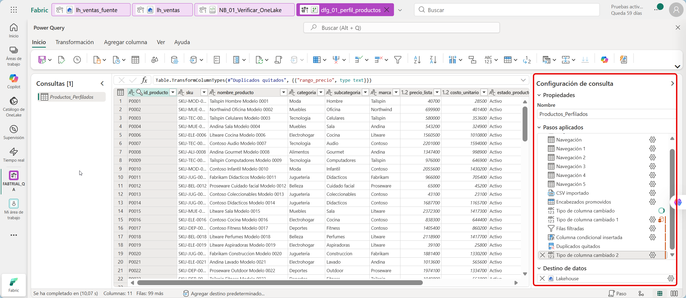
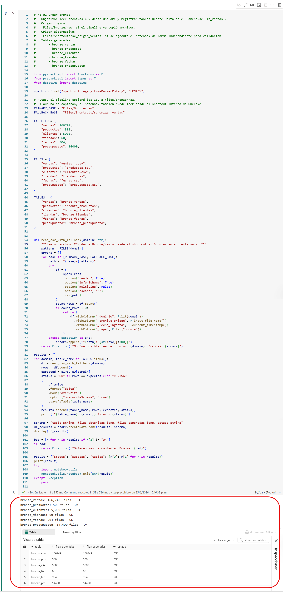
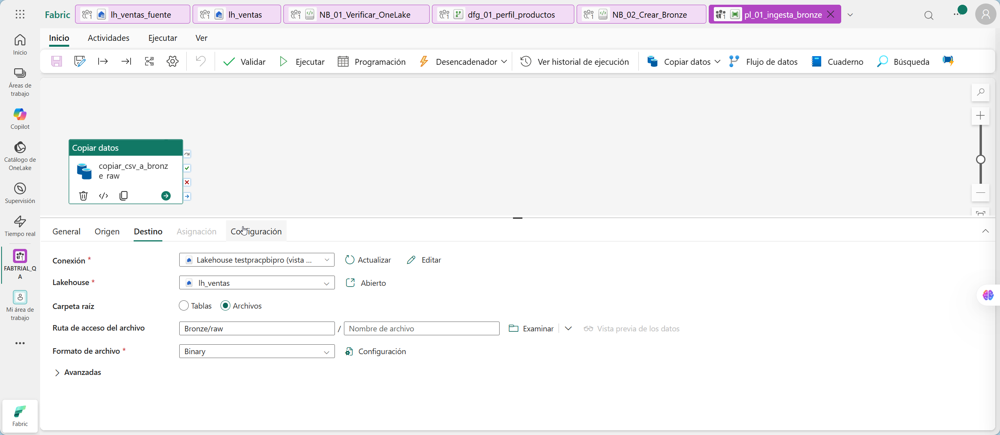
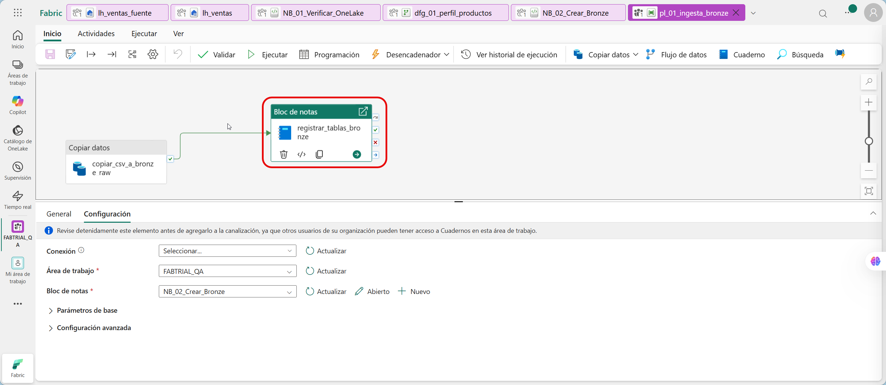
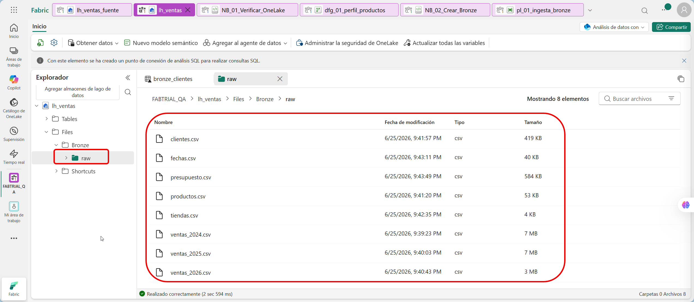
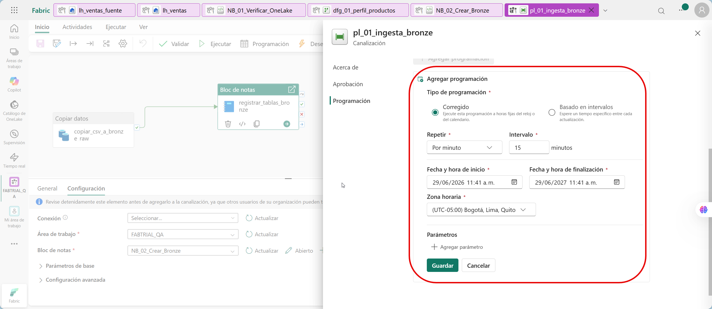

# Construcción de pipeline de ingesta automatizada hacia capa Bronze

---

## 1. Metadatos

| Atributo | Detalle |
|---|---|
| **Duración estimada** | 105 minutos |
| **Complejidad** | Alta |
| **Nivel Bloom** | Crear (*Create*) |
| **Módulo** | Capítulo 2 - Ingesta y Orquestación con Data Factory |
| **Laboratorio previo requerido** | Capítulo 1 completado |
| **Tecnología principal** | Microsoft Fabric Data Factory, Dataflow Gen2 y Notebook activity |
| **Produce artefactos para** | Capítulos 3, 4 y 5 |

---

## 2. Descripción general

En este laboratorio automatizarás la carga de datos hacia la capa Bronze de la arquitectura Medallion. El origen de trabajo será el shortcut interno de OneLake creado en el Capítulo 1.

Construirás un pipeline de Data Factory llamado `pl_01_ingesta_bronze` para orquestar la ingesta desde `Files/Shortcuts/sc_origen_ventas` hacia la zona Bronze del Lakehouse `lh_ventas` y registrar los datos como tablas Delta. También crearás un Dataflow Gen2 ligero para practicar transformación visual sin alterar la ruta crítica del taller.

Para asegurar que el flujo sea reproducible en todos los tenants, se usará un patrón híbrido:

1. **Actividad Copy Data**, para practicar ingesta visual desde Lakehouse/OneLake hacia `Files/Bronze/raw`.
2. **Actividad Notebook**, para registrar y validar las tablas Bronze en formato Delta.
3. **Monitor Hub**, para revisar ejecución, duración, estado y errores.
4. **Dataflow Gen2**, para realizar una transformación visual de perfilamiento sin alterar la ruta crítica del taller.

> El notebook es parte del flujo orquestado por Data Factory. Todo el laboratorio se realiza manualmente desde la interfaz de Microsoft Fabric.

---

## 3. Objetivos de aprendizaje

Al completar este laboratorio serás capaz de:

- Crear un Dataflow Gen2 básico para transformación visual en Microsoft Fabric.
- Crear un pipeline de Data Factory en Microsoft Fabric.
- Configurar una actividad de copia entre rutas de OneLake/Lakehouse.
- Entender la diferencia entre archivos en `Files` y tablas en `Tables`.
- Crear un notebook de registro Bronze que lea CSV y escriba tablas Delta.
- Ejecutar el notebook desde un pipeline mediante Notebook activity.
- Monitorear la ejecución del pipeline y revisar logs.
- Validar conteos de tablas Bronze y tabla de perfilamiento.

---

## 4. Prerrequisitos

### 4.1 Artefactos requeridos del Capítulo 1

Antes de comenzar, confirma que existen:

| Artefacto | Nombre esperado | Estado |
|---|---|---|
| Workspace | `FABTRIAL_<alias>` | ☐ |
| Lakehouse fuente | `lh_ventas_fuente` | ☐ |
| Lakehouse principal | `lh_ventas` | ☐ |
| Shortcut | `Files/Shortcuts/sc_origen_ventas` | ☐ |
| Archivos fuente | 8 CSV en el shortcut | ☐ |
| Notebook validación | `NB_01_Verificar_OneLake` ejecutado sin error | ☐ |

### 4.2 Conocimientos requeridos

| Área | Nivel requerido |
|---|---|
| Navegación en Fabric Data Factory | Básico |
| Conceptos de pipeline y actividad | Básico |
| Concepto Bronze/Silver/Gold | Básico |
| Lectura de logs | Básico |
| PySpark | Copiar/pegar y ejecutar celdas guiadas |

---

## 5. Resultado esperado del laboratorio

Al finalizar este laboratorio tendrás:

```text
Workspace FABTRIAL_<alias>
├── lh_ventas
│   ├── Files/Bronze/raw/*.csv
│   └── Tables
│       ├── bronze_ventas
│       ├── bronze_productos
│       ├── bronze_clientes
│       ├── bronze_tiendas
│       ├── bronze_fechas
│       ├── bronze_presupuesto
│       └── dfg_productos_perfilados
├── dfg_01_perfil_productos
├── NB_02_Crear_Bronze
└── pl_01_ingesta_bronze
```

Conteos esperados:

| Tabla | Filas esperadas |
|---|---:|
| `bronze_ventas` | 166.742 |
| `bronze_productos` | 500 |
| `bronze_clientes` | 5.000 |
| `bronze_tiendas` | 60 |
| `bronze_fechas` | 904 |
| `bronze_presupuesto` | 14.400 |
| `dfg_productos_perfilados` | 482 productos activos |

---

## 6. Conceptos clave antes de iniciar

### 6.1 Archivos vs. tablas en Lakehouse

En un Lakehouse de Fabric existen dos áreas visibles:

| Área | Uso |
|---|---|
| `Files` | Archivos crudos, semiestructurados o de intercambio. Ejemplo: CSV, JSON, Parquet. |
| `Tables` | Tablas Delta registradas, consultables desde Spark, SQL endpoint y Power BI Direct Lake. |

En este capítulo los CSV se llevarán a Bronze y se registrarán como tablas Delta para que el Capítulo 3 pueda leerlas de forma robusta.

### 6.2 Por qué crear tablas Bronze

Un error frecuente en laboratorios Medallion es dejar la capa Bronze solo como archivos CSV. Eso rompe capítulos posteriores que esperan tablas. En esta versión, el Capítulo 2 termina con tablas Delta Bronze reales.

### 6.3 Nombres canónicos de Bronze

| Dominio | Archivo fuente | Tabla Bronze |
|---|---|---|
| Ventas | `ventas_*.csv` | `bronze_ventas` |
| Productos | `productos.csv` | `bronze_productos` |
| Clientes | `clientes.csv` | `bronze_clientes` |
| Tiendas | `tiendas.csv` | `bronze_tiendas` |
| Fechas | `fechas.csv` | `bronze_fechas` |
| Presupuesto | `presupuesto.csv` | `bronze_presupuesto` |

### 6.4 Dataflow Gen2 en este capítulo

El temario del taller incluye Dataflows Gen2 como experiencia de transformación visual. En este capítulo se agrega una práctica acotada para que el participante use Power Query Online, escriba una salida en Lakehouse y luego continúe con la ruta principal de pipeline + notebook.

El Dataflow Gen2 `dfg_01_perfil_productos` crea la tabla auxiliar `dfg_productos_perfilados`. Esta tabla permite practicar transformación visual con Power Query Online y validar escritura hacia Lakehouse.

| Elemento | Decisión de diseño |
|---|---|
| Origen | `productos.csv` desde OneLake. |
| Transformación | Filtrar productos activos, revisar tipos y crear `rango_precio`. |
| Destino | Tabla `dfg_productos_perfilados` en `lh_ventas`. |
| Uso posterior | Validación y discusión; no es requisito para Capítulo 3. |

> Si la experiencia de Dataflow Gen2 no está disponible en el tenant, documenta la limitación y continúa con el pipeline y notebooks. La ruta crítica del taller sigue funcionando.


---

## 7. Procedimiento paso a paso

### Paso 1 - Verificar el shortcut y los archivos fuente

**Objetivo:** confirmar que el origen creado en el Capítulo 1 está disponible.

#### Instrucciones

1. Abre `https://app.fabric.microsoft.com`.
2. Entra al workspace `FABTRIAL_<alias>`.
3. Abre el Lakehouse `lh_ventas`.
4. En el panel izquierdo, expande:

   ```text
   Files > Shortcuts > sc_origen_ventas
   ```

5. Confirma que ves estos archivos:

   ```text
   ventas_2024.csv
   ventas_2025.csv
   ventas_2026.csv
   productos.csv
   clientes.csv
   tiendas.csv
   fechas.csv
   presupuesto.csv
   ```

#### Resultado esperado

Los ocho archivos aparecen en el shortcut.

#### Validación

Si falta un archivo, regresa al Capítulo 1 y vuelve a cargarlo en `lh_ventas_fuente/Files/origen/ventas/raw`.

---

### Paso 1A - Crear Dataflow Gen2 de transformación visual

**Objetivo:** practicar transformación visual con Power Query Online y guardar el resultado como tabla del Lakehouse `lh_ventas`.

Este paso cubre el componente de **Dataflows Gen2** del temario. La salida es una tabla auxiliar de aprendizaje y no reemplaza el pipeline ni las tablas Bronze.

#### Instrucciones

1. Regresa al workspace `FABTRIAL_<alias>`.
2. Selecciona **+ New item**.
3. Busca y selecciona **Dataflow Gen2**.
4. Cambia el nombre del elemento a:

   ```text
   dfg_01_perfil_productos
   ```

5. En la experiencia de Power Query Online, selecciona **Get data**.
6. Elige **Lakehouse**.
7. Selecciona el workspace `FABTRIAL_<alias>`.
8. Selecciona el Lakehouse `lh_ventas`.
9. Navega a la ruta principal del laboratorio:

   ```text
   Files > Shortcuts > sc_origen_ventas > productos.csv
   ```

10. Si el selector no muestra archivos bajo el shortcut, usa esta ruta alternativa, que sigue estando dentro de OneLake:

    ```text
    Lakehouse: lh_ventas_fuente
    Files > origen > ventas > raw > productos.csv
    ```

11. Selecciona **Transform data**.
12. Renombra la consulta a:

    ```text
    Productos_Perfilados
    ```

13. Valida o ajusta los tipos de datos principales:

    | Columna | Tipo esperado |
    |---|---|
    | `id_producto` | Text |
    | `sku` | Text |
    | `nombre_producto` | Text |
    | `categoria` | Text |
    | `subcategoria` | Text |
    | `marca` | Text |
    | `precio_lista` | Decimal number |
    | `costo_unitario` | Decimal number |
    | `estado_producto` | Text |
    | `fecha_actualizacion` | Date |

14. Filtra la columna `estado_producto` para conservar solo:

    ```text
    Activo
    ```

15. Agrega una columna condicional llamada:

    ```text
    rango_precio
    ```

    con esta lógica:

    | Condición | Valor |
    |---|---|
    | `precio_lista` es mayor o igual a `1000000` | `Alto` |
    | `precio_lista` es mayor o igual a `300000` | `Medio` |
    | En caso contrario | `Bajo` |

16. Cambia el tipo de dato de `rango_precio` a **Text**. Este paso es obligatorio. Si queda como **Any/Cualquiera**, Fabric puede no materializar correctamente la columna en la tabla destino.
17. Usa **Remove rows > Remove duplicates** sobre la columna `id_producto`.
18. En el panel derecho, selecciona **Choose data destination** o el engranaje del destino.
19. Selecciona **Lakehouse** como destino.
20. Elige el workspace `FABTRIAL_<alias>` y el Lakehouse:

    ```text
    lh_ventas
    ```

21. Configura una tabla nueva llamada:

    ```text
    dfg_productos_perfilados
    ```

22. Usa método de actualización **Replace** o **Reemplazar**.
23. En asignación de columnas, usa **Asignar automáticamente y permitir cambio de esquema**.
24. Selecciona **Save and run** o **Guardar y ejecutar**.
25. Espera a que el refresh termine con estado **Succeeded**, **Correcto** o **Completado**.



#### Resultado esperado

El Dataflow Gen2 `dfg_01_perfil_productos` termina con estado exitoso y crea la tabla auxiliar:

```text
dfg_productos_perfilados
```

La tabla debe quedar como tabla normal en `lh_ventas`. No debe quedar bajo **Tables > Sin identificar**.

#### Validación

En el SQL analytics endpoint de `lh_ventas`, ejecuta primero:

```sql
SELECT
    COLUMN_NAME,
    DATA_TYPE
FROM INFORMATION_SCHEMA.COLUMNS
WHERE TABLE_NAME = 'dfg_productos_perfilados'
ORDER BY ORDINAL_POSITION;
```

Debe aparecer la columna:

```text
rango_precio    varchar
```

Luego ejecuta:

```sql
SELECT
    COUNT(*) AS productos_activos,
    COUNT(DISTINCT id_producto) AS productos_unicos
FROM dfg_productos_perfilados;
```

Resultado esperado:

| Métrica | Valor esperado |
|---|---:|
| `productos_activos` | 482 |
| `productos_unicos` | 482 |

Finalmente valida la clasificación:

```sql
SELECT
    estado_producto,
    rango_precio,
    COUNT(*) AS productos
FROM dfg_productos_perfilados
GROUP BY estado_producto, rango_precio
ORDER BY estado_producto, rango_precio;
```

El resultado debe mostrar únicamente productos `Activo` y valores de `rango_precio` como `Alto`, `Medio` y `Bajo`.

Si la tabla tarda en aparecer en el SQL endpoint, espera de 30 a 90 segundos y actualiza el panel de objetos.

Si `rango_precio` aparece en la vista previa del Dataflow pero no en SQL, revisa que el tipo de dato de `rango_precio` sea **Text** y vuelve a ejecutar **Guardar y ejecutar**.

---

### Paso 2 - Crear el notebook `NB_02_Crear_Bronze`

**Objetivo:** construir el notebook que registrará las tablas Bronze en Delta.

#### Instrucciones

1. Regresa al workspace `FABTRIAL_<alias>`.
2. Selecciona **+ New item**.
3. Busca **Notebook**.
4. Selecciona **Notebook**.
5. Cambia el nombre a:

   ```text
   NB_02_Crear_Bronze
   ```

6. En el panel izquierdo del notebook, selecciona **Add lakehouse**.
7. Selecciona **Existing lakehouse**.
8. Elige:

   ```text
   lh_ventas
   ```

9. Confirma que `lh_ventas` aparece adjunto al notebook.

#### Resultado esperado

Existe el notebook `NB_02_Crear_Bronze` con el Lakehouse `lh_ventas` agregado.

---

### Paso 3 - Agregar encabezado documental al notebook

**Objetivo:** documentar el propósito del notebook para que sea mantenible.

#### Instrucciones

1. En el notebook, agrega una celda de tipo **Markdown**.
2. Copia el siguiente contenido:

```markdown
# NB_02_Crear_Bronze

Objetivo: leer archivos CSV desde OneLake y registrar tablas Bronze Delta en el Lakehouse `lh_ventas`.

Origen lógico:
`Files/Bronze/raw` si el pipeline ya copió archivos.

Origen alternativo:
`Files/Shortcuts/sc_origen_ventas` si se ejecuta el notebook de forma independiente para validación.

Tablas generadas:
- bronze_ventas
- bronze_productos
- bronze_clientes
- bronze_tiendas
- bronze_fechas
- bronze_presupuesto
```

3. Ejecuta la celda Markdown.

#### Resultado esperado

El notebook queda documentado antes del código.

---

### Paso 4 - Pegar el código de creación Bronze

**Objetivo:** crear las tablas Delta Bronze a partir de los CSV.

#### Instrucciones

1. Agrega una celda de código debajo del encabezado.
2. Copia y ejecuta el siguiente código.
3. Espera a que Spark inicie. La primera ejecución puede tardar varios minutos.

```python
from pyspark.sql import functions as F
from pyspark.sql import types as T
from datetime import datetime

spark.conf.set("spark.sql.legacy.timeParserPolicy", "LEGACY")

# Rutas. El pipeline copiará los CSV a Files/Bronze/raw.
# Si aún no se copiaron, el notebook también puede leer desde el shortcut interno de OneLake.
PRIMARY_BASE = "Files/Bronze/raw"
FALLBACK_BASE = "Files/Shortcuts/sc_origen_ventas"

EXPECTED = {
    "ventas": 166742,
    "productos": 500,
    "clientes": 5000,
    "tiendas": 60,
    "fechas": 904,
    "presupuesto": 14400,
}

FILES = {
    "ventas": "ventas_*.csv",
    "productos": "productos.csv",
    "clientes": "clientes.csv",
    "tiendas": "tiendas.csv",
    "fechas": "fechas.csv",
    "presupuesto": "presupuesto.csv",
}

TABLES = {
    "ventas": "bronze_ventas",
    "productos": "bronze_productos",
    "clientes": "bronze_clientes",
    "tiendas": "bronze_tiendas",
    "fechas": "bronze_fechas",
    "presupuesto": "bronze_presupuesto",
}


def read_csv_resilient(domain: str):
    """Lee un archivo CSV desde Bronze/raw o desde el shortcut si Bronze/raw aún está vacío."""
    pattern = FILES[domain]
    errors = []

    for base in [PRIMARY_BASE, FALLBACK_BASE]:
        path = f"{base}/{pattern}"
        try:
            df = (
                spark.read
                .option("header", True)
                .option("inferSchema", True)
                .option("multiLine", False)
                .option("escape", '"')
                .csv(path)
            )
            count_rows = df.count()
            if count_rows > 0:
                return (
                    df.withColumn("_dominio", F.lit(domain))
                      .withColumn("_archivo_origen", F.input_file_name())
                      .withColumn("_fecha_ingesta", F.current_timestamp())
                      .withColumn("_capa", F.lit("bronze"))
                )
        except Exception as exc:
            errors.append(f"{path}: {str(exc)[:300]}")

    raise Exception(f"No fue posible leer el dominio {domain}. Errores: {errors}")


results = []

for domain, table_name in TABLES.items():
    df = read_csv_resilient(domain)
    rows = df.count()
    expected = EXPECTED[domain]
    status = "OK" if rows == expected else "REVISAR"

    (
        df.write
        .format("delta")
        .mode("overwrite")
        .option("overwriteSchema", "true")
        .saveAsTable(table_name)
    )

    results.append((table_name, rows, expected, status))
    print(f"{table_name}: {rows:,} filas - {status}")

schema = "tabla string, filas_obtenidas long, filas_esperadas long, estado string"
df_results = spark.createDataFrame(results, schema)
display(df_results)

bad = [r for r in results if r[3] != "OK"]
if bad:
    raise Exception(f"Las tablas Bronze se crearon, pero hay diferencias de conteo: {bad}")

print("Proceso Bronze completado correctamente.")
```


#### Resultado esperado

El notebook crea seis tablas Bronze y muestra estado `OK` para todas.

#### Validación

En el panel izquierdo del Lakehouse `lh_ventas`, expande **Tables**. Deben aparecer:

```text
bronze_ventas
bronze_productos
bronze_clientes
bronze_tiendas
bronze_fechas
bronze_presupuesto
```

---

### Paso 5 - Crear el pipeline `pl_01_ingesta_bronze`

**Objetivo:** crear el pipeline de Data Factory que orquestará la ingesta.

#### Instrucciones

1. Regresa al workspace `FABTRIAL_<alias>`.
2. Selecciona **+ New item**.
3. Busca **Data pipeline** (Canalización).
4. Selecciona **Data pipeline**.
5. En **Name**, escribe:

   ```text
   pl_01_ingesta_bronze
   ```

6. Selecciona **Create**.
7. Espera a que se abra el diseñador del pipeline.

#### Resultado esperado

El pipeline `pl_01_ingesta_bronze` existe en el workspace.

---

### Paso 6 - Agregar actividad Copy Data hacia `Files/Bronze/raw`

**Objetivo:** practicar la ingesta visual desde el shortcut interno hacia la zona Bronze de archivos.

#### Instrucciones

1. En el lienzo del pipeline, selecciona **Add activity**.
2. Selecciona **Copy data**.
3. Renombra la actividad como:

   ```text
   copiar_csv_a_bronze_raw
   ```

4. En la pestaña **Source**, selecciona o crea una conexión hacia Lakehouse.
5. Como origen, selecciona el Lakehouse:

   ```text
   lh_ventas
   ```

6. En la ruta de archivos, selecciona:

   ```text
   Files/Shortcuts/sc_origen_ventas
   ```

7. Si el asistente permite seleccionar múltiples archivos, selecciona los ocho CSV.
8. Si el asistente permite wildcard, usa:

   ```text
   *.csv
   ```

9. Activa **Recursive** si aparece disponible.
10. En la pestaña **Destination**, selecciona el Lakehouse:

    ```text
    lh_ventas
    ```

11. Como carpeta destino, selecciona o escribe:

    ```text
    Files/Bronze/raw
    ```

12. Guarda la actividad.



#### Resultado esperado

La actividad Copy Data queda configurada para copiar los CSV visibles por el shortcut hacia la carpeta `Files/Bronze/raw`.

#### Validación

En el canvas del pipeline debe verse una actividad llamada `copiar_csv_a_bronze_raw` sin advertencias obligatorias.

> Nota: las etiquetas exactas de la interfaz pueden variar. La clave es que origen y destino sean elementos Lakehouse/OneLake dentro del workspace del taller.

---

### Paso 7 - Agregar actividad Notebook para registrar Bronze

**Objetivo:** ejecutar el notebook `NB_02_Crear_Bronze` desde el pipeline.

#### Instrucciones

1. En el pipeline, selecciona **Add activity**.
2. Busca **Notebook**.
3. Agrega una actividad **Notebook** al canvas.
4. Renombra la actividad como:

   ```text
   registrar_tablas_bronze
   ```

5. Conecta la salida exitosa de `copiar_csv_a_bronze_raw` hacia `registrar_tablas_bronze`.
6. Selecciona la actividad `registrar_tablas_bronze`.
7. En configuración, selecciona el notebook:

   ```text
   NB_02_Crear_Bronze
   ```

8. Si Fabric solicita Lakehouse predeterminado, selecciona:

   ```text
   lh_ventas
   ```

9. No agregues parámetros por ahora.
10. Guarda el pipeline.



#### Resultado esperado

El pipeline queda con dos actividades conectadas:

```text
copiar_csv_a_bronze_raw  -->  registrar_tablas_bronze
```

#### Validación

No debe aparecer ningún icono rojo de configuración incompleta en las actividades.

---

### Paso 8 - Validar el pipeline antes de ejecutarlo

**Objetivo:** detectar errores de configuración antes de iniciar el proceso.

#### Instrucciones

1. En la barra superior del pipeline, selecciona **Validate**.
2. Espera la validación.
3. Si aparece un error, ábrelo y revisa el detalle.
4. Corrige rutas o artefactos faltantes.
5. Repite la validación hasta que no aparezcan errores críticos.

#### Resultado esperado

Fabric muestra que el pipeline es válido o no tiene errores bloqueantes.

---

### Paso 9 - Ejecutar el pipeline manualmente

**Objetivo:** lanzar la ingesta Bronze de forma controlada.

#### Instrucciones

1. En el pipeline `pl_01_ingesta_bronze`, selecciona **Run**.
2. Si Fabric pide guardar cambios, selecciona **Save and run**.
3. Confirma la ejecución.
4. Espera a que inicie el run.
5. Observa el estado de cada actividad.

#### Resultado esperado

Ambas actividades terminan en estado **Succeeded**.

```text
copiar_csv_a_bronze_raw     Succeeded
registrar_tablas_bronze     Succeeded
```

#### Validación

Si la actividad Copy Data falla por una variación de la interfaz, ejecuta el notebook manualmente para continuar y revisa la configuración de la actividad. El flujo final esperado sigue siendo pipeline + notebook activity.

---

### Paso 10 - Verificar archivos en `Files/Bronze/raw`

**Objetivo:** confirmar que la copia visual depositó los archivos en la zona Bronze.

#### Instrucciones

1. Abre el Lakehouse `lh_ventas`.
2. Navega a:

   ```text
   Files > Bronze > raw
   ```

3. Confirma que aparecen archivos CSV.
4. Si se creó una subcarpeta adicional por comportamiento de copia, ábrela y localiza los CSV.



#### Resultado esperado

La zona Bronze contiene los CSV copiados desde el shortcut.

#### Validación

Debe ser posible ver al menos:

```text
ventas_2024.csv
ventas_2025.csv
ventas_2026.csv
productos.csv
clientes.csv
tiendas.csv
fechas.csv
presupuesto.csv
```

---

### Paso 11 - Verificar tablas Bronze en el Lakehouse

**Objetivo:** confirmar que los datos fueron registrados como Delta tables.

#### Instrucciones

1. En `lh_ventas`, expande **Tables**.
2. Confirma que existen las seis tablas Bronze.
3. Abre una tabla, por ejemplo `bronze_ventas`.
4. Usa **Preview data** para revisar columnas y primeras filas.

#### Resultado esperado

`bronze_ventas` muestra columnas como:

```text
id_transaccion
fecha_venta
id_cliente
id_producto
id_tienda
cantidad
precio_unitario
descuento_pct
metodo_pago
canal_venta
estado_transaccion
moneda
costo_unitario
vendedor_id
origen_dato
_dominio
_archivo_origen
_fecha_ingesta
_capa
```

#### Validación

El campo `_capa` debe tener valor `bronze`.

---

### Paso 12 - Validar conteos desde el SQL analytics endpoint

**Objetivo:** comprobar que las tablas Bronze son consultables por SQL.

#### Instrucciones

1. Abre `lh_ventas`.
2. En la parte superior derecha, cambia a **SQL analytics endpoint**.
3. Selecciona **New SQL query**.
4. Ejecuta:

```sql
SELECT 'bronze_ventas' AS tabla, COUNT(*) AS filas FROM bronze_ventas
UNION ALL
SELECT 'bronze_productos', COUNT(*) FROM bronze_productos
UNION ALL
SELECT 'bronze_clientes', COUNT(*) FROM bronze_clientes
UNION ALL
SELECT 'bronze_tiendas', COUNT(*) FROM bronze_tiendas
UNION ALL
SELECT 'bronze_fechas', COUNT(*) FROM bronze_fechas
UNION ALL
SELECT 'bronze_presupuesto', COUNT(*) FROM bronze_presupuesto;
```

#### Resultado esperado

| Tabla | Filas esperadas |
|---|---:|
| `bronze_ventas` | 166742 |
| `bronze_productos` | 500 |
| `bronze_clientes` | 5000 |
| `bronze_tiendas` | 60 |
| `bronze_fechas` | 904 |
| `bronze_presupuesto` | 14400 |

#### Validación

Si el SQL endpoint no muestra inmediatamente una tabla recién creada, espera de 30 a 90 segundos y actualiza el panel de objetos.

---

### Paso 13 - Revisar la ejecución en Monitor Hub

**Objetivo:** interpretar logs de ejecución del pipeline.

#### Instrucciones

1. En el menú izquierdo de Fabric, selecciona **Monitor**.
2. Busca el run más reciente de:

   ```text
   pl_01_ingesta_bronze
   ```

3. Abre el detalle del run.
4. Revisa duración, estado y actividades ejecutadas.
5. Abre el detalle de `registrar_tablas_bronze`.
6. Revisa salida, logs o mensajes disponibles.

#### Resultado esperado

El run aparece como **Succeeded**.

---

### Paso 14 - Configurar ejecución programada opcional

**Objetivo:** conocer cómo se automatiza una ejecución recurrente.

Esta parte es opcional para evitar consumir tiempo innecesario en Trial.

#### Instrucciones

1. Abre `pl_01_ingesta_bronze`.
2. Selecciona **Schedule** o **Trigger** si aparece disponible.
3. Crea un trigger diario, por ejemplo 7:00 a. m.
4. Guarda la configuración.
5. Deshabilita el trigger si no deseas ejecuciones automáticas posteriores.



#### Resultado esperado

Entiendes dónde se configura un schedule sin depender de él para el taller.

---

## 8. Validación general del laboratorio

Completa esta lista antes de continuar al Capítulo 3.

| Validación | Estado |
|---|---|
| Existe `dfg_01_perfil_productos`. | ☐ |
| El Dataflow Gen2 ejecutó correctamente. | ☐ |
| Existe `dfg_productos_perfilados` con 482 filas si el Dataflow ejecutó. | ☐ |
| Existe `NB_02_Crear_Bronze`. | ☐ |
| `NB_02_Crear_Bronze` tiene agregado `lh_ventas`. | ☐ |
| Existe `pl_01_ingesta_bronze`. | ☐ |
| El pipeline tiene actividad Copy Data. | ☐ |
| El pipeline tiene actividad Notebook. | ☐ |
| El pipeline ejecutó con estado Succeeded. | ☐ |
| Hay archivos en `Files/Bronze/raw`. | ☐ |
| Existen seis tablas `bronze_*`. | ☐ |
| Los conteos SQL coinciden con los esperados. | ☐ |

---

## 9. Errores frecuentes y solución

### Problema 1 - La actividad Copy Data no permite seleccionar el shortcut

**Causa probable:** variación de interfaz o limitación temporal del asistente.

**Solución:**

1. Asegúrate de seleccionar el Lakehouse `lh_ventas` como origen.
2. Revisa que `sc_origen_ventas` aparece bajo `Files/Shortcuts`.
3. Si el asistente no permite la selección, continúa con la actividad Notebook. El notebook también puede leer desde el shortcut y crear las tablas Bronze.
4. Documenta el comportamiento para comentarlo en clase.

---

### Problema 2 - El notebook falla porque no encuentra archivos en `Files/Bronze/raw`

**Causa probable:** la actividad Copy Data no copió archivos.

**Solución:**

El notebook intenta leer primero `Files/Bronze/raw` y luego `Files/Shortcuts/sc_origen_ventas`. Si ambos fallan:

1. Revisa que el shortcut exista.
2. Revisa que los CSV estén cargados en `lh_ventas_fuente`.
3. Revisa que el Lakehouse `lh_ventas` esté agregado al notebook.

---

### Problema 3 - El SQL endpoint no muestra tablas Bronze

**Causa probable:** sincronización de metadatos pendiente.

**Solución:**

1. Espera de 30 a 90 segundos.
2. Actualiza el navegador.
3. Vuelve a abrir el SQL analytics endpoint.
4. Si siguen sin aparecer, vuelve al notebook y confirma que `saveAsTable` terminó sin error.

---

### Problema 4 - Los conteos no coinciden

**Causa probable:** faltó cargar un archivo o se cargó duplicado.

**Solución:**

1. Revisa `datos/manifest_datos.csv`.
2. Verifica en `lh_ventas_fuente` que hay exactamente ocho CSV.
3. Elimina archivos duplicados en `Files/Bronze/raw` si los copiaste más de una vez manualmente.
4. Reejecuta el notebook Bronze con modo overwrite.

---

### Problema 5 - El Dataflow Gen2 no permite configurar destino de Lakehouse

**Causa probable:** permisos insuficientes, experiencia de Dataflow Gen2 no habilitada o variación de interfaz.

**Solución:**

1. Verifica que el destino sea `lh_ventas`.
2. Usa método **Replace**.
3. Verifica que el destino sea `lh_ventas` y que la tabla destino sea `dfg_productos_perfilados`.
4. Confirma que la columna `rango_precio` tenga tipo **Text** antes de guardar y ejecutar.
5. Si el problema continúa, revisa permisos del workspace y vuelve a configurar el destino de datos.

---

## 10. Validación de cierre

Antes de continuar al siguiente capítulo, confirma:

1. El pipeline `pl_01_ingesta_bronze` existe y contiene las actividades esperadas.
2. Monitor Hub muestra una ejecución correcta del flujo.
3. Las tablas Bronze existen en `lh_ventas`.
4. La consulta SQL de conteos devuelve los valores esperados.
5. El notebook finalizó con mensaje de proceso completado.
6. El Dataflow Gen2 `dfg_01_perfil_productos` ejecutó correctamente y creó `dfg_productos_perfilados`.

---

## 11. Cierre del laboratorio

En este capítulo automatizaste la ingesta hacia Bronze, validaste la orquestación con Data Factory y practicaste Dataflow Gen2. Ahora `lh_ventas` contiene tablas Delta Bronze consultables desde Spark y SQL, listas para continuar con las transformaciones Silver y Gold.

El Capítulo 3 usará estas tablas para aplicar reglas de calidad, estandarizar datos y crear las capas Silver y Gold.

---

## 12. Preguntas de reflexión

1. ¿Qué diferencia operativa viste entre transformar visualmente con Dataflow Gen2 y registrar tablas con Notebook?
2. ¿Por qué es más robusto terminar Bronze como tablas Delta y no solo como CSV en Files?
3. ¿Qué diferencia hay entre copiar datos hacia Bronze y leerlos mediante shortcut?
4. ¿Qué valor aporta Monitor Hub en procesos productivos?
5. ¿Qué ocurriría si el Capítulo 3 intentara leer `bronze_ventas` y la tabla no existiera?
6. ¿Qué parte del pipeline sería más fácil de parametrizar si el volumen de archivos creciera?

