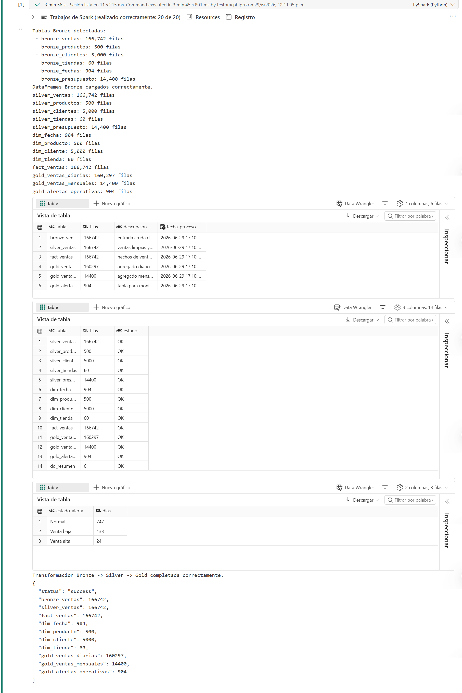
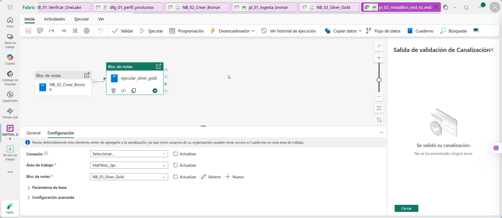

# Ingeniería de datos: Transformación Bronze → Silver → Gold con Notebook guiado

---

## 1. Metadatos

| Atributo | Detalle |
|---|---|
| **Duración estimada** | 105 minutos |
| **Complejidad** | Alta |
| **Nivel Bloom** | Analizar / Crear |
| **Módulo** | Capítulo 3 - Transformación con Spark y SQL Endpoint |
| **Laboratorio previo requerido** | Capítulos 1 y 2 completados |
| **Tecnología principal** | Fabric Notebook, Spark SQL, Delta Lake |
| **Produce artefactos para** | Capítulos 4 y 5 |

---

## 2. Descripción general

En este laboratorio transformarás las tablas Bronze generadas en el Capítulo 2 hacia una arquitectura Medallion completa. Trabajarás con un notebook de Microsoft Fabric para aplicar reglas de calidad, normalizar tipos de datos, enriquecer ventas con dimensiones y construir tablas Gold listas para analítica.

Este laboratorio parte de las tablas `bronze_*` creadas y validadas en el Capítulo 2. Antes de iniciar, confirmarás que esas tablas existen para continuar con un flujo controlado y verificable.

El resultado final incluye:

- Tablas Silver limpias y tipadas.
- Dimensiones y tabla de hechos para modelado analítico.
- Tablas Gold agregadas para análisis mensual, diario y monitoreo.
- Tabla de control de calidad `dq_resumen`.
- Validaciones desde SQL analytics endpoint.

---

## 3. Objetivos de aprendizaje

Al completar este laboratorio serás capaz de:

- Leer tablas Delta Bronze desde un Lakehouse de Fabric.
- Aplicar reglas de calidad de datos con Spark.
- Estandarizar tipos de datos, fechas, textos y llaves.
- Construir tablas Silver reutilizables.
- Crear una tabla de hechos y dimensiones tipo estrella.
- Crear agregaciones Gold para Power BI y monitoreo.
- Validar las tablas creadas desde Spark y SQL endpoint.
- Integrar un notebook de transformación a un pipeline de Fabric Data Factory.

---

## 4. Prerrequisitos

### 4.1 Artefactos requeridos del Capítulo 2

| Artefacto | Nombre esperado | Estado |
|---|---|---|
| Lakehouse principal | `lh_ventas` | ☐ |
| Notebook Bronze | `NB_02_Crear_Bronze` | ☐ |
| Pipeline Bronze | `pl_01_ingesta_bronze` | ☐ |
| Tabla | `bronze_ventas` | ☐ |
| Tabla | `bronze_productos` | ☐ |
| Tabla | `bronze_clientes` | ☐ |
| Tabla | `bronze_tiendas` | ☐ |
| Tabla | `bronze_fechas` | ☐ |
| Tabla | `bronze_presupuesto` | ☐ |

### 4.2 Conocimientos requeridos

| Área | Nivel requerido |
|---|---|
| SQL básico | Intermedio |
| Concepto Bronze/Silver/Gold | Básico |
| Lectura de notebooks | Básico |
| PySpark | Guiado, no se requiere programar desde cero |
| Modelado dimensional | Conceptual |

---

## 5. Resultado esperado del laboratorio

Al finalizar, el Lakehouse `lh_ventas` tendrá estas tablas adicionales:

```text
Tables/
├── silver_ventas
├── silver_productos
├── silver_clientes
├── silver_tiendas
├── silver_presupuesto
├── dim_fecha
├── dim_producto
├── dim_cliente
├── dim_tienda
├── fact_ventas
├── gold_ventas_diarias
├── gold_ventas_mensuales
├── gold_alertas_operativas
└── dq_resumen
```

Conteos esperados principales:

| Tabla | Filas esperadas aproximadas |
|---|---:|
| `silver_ventas` | 166.742 |
| `fact_ventas` | 166.742 |
| `dim_producto` | 500 |
| `dim_cliente` | 5.000 |
| `dim_tienda` | 60 |
| `dim_fecha` | 904 |
| `gold_ventas_diarias` | Alrededor de 160.000 |
| `gold_ventas_mensuales` | 14.400 |
| `gold_alertas_operativas` | 904 |

> `gold_ventas_diarias` puede ser menor que `fact_ventas` porque es una agregación por fecha, tienda, región, canal y categoría.

---

## 6. Contrato de datos entre capas

### 6.1 Bronze

Bronze conserva los datos de origen con mínima intervención y agrega columnas técnicas:

```text
_dominio
_archivo_origen
_fecha_ingesta
_capa
```

### 6.2 Silver

Silver aplica:

- Tipado de fechas.
- Tipado decimal de importes.
- Normalización de llaves.
- Eliminación de duplicados por llave natural.
- Cálculo de importes básicos.
- Homologación de textos.

### 6.3 Gold

Gold queda lista para consumo:

- `fact_ventas`: fact table de transacciones completadas.
- `dim_fecha`, `dim_producto`, `dim_cliente`, `dim_tienda`: dimensiones para modelo estrella.
- `gold_ventas_diarias`: agregación diaria para análisis y monitoreo.
- `gold_ventas_mensuales`: agregación mensual con presupuesto.
- `gold_alertas_operativas`: tabla de soporte para el Lab 05.

---

## 7. Procedimiento paso a paso

### Paso 1 - Verificar tablas Bronze

**Objetivo:** confirmar que el estado inicial es correcto.

#### Instrucciones

1. Abre el workspace `FABTRIAL_<alias>`.
2. Abre el Lakehouse `lh_ventas`.
3. Expande **Tables**.
4. Confirma que existen las seis tablas Bronze.
5. Cambia al **SQL analytics endpoint**.
6. Ejecuta:

```sql
SELECT 'bronze_ventas' AS tabla, COUNT(*) AS filas FROM bronze_ventas
UNION ALL SELECT 'bronze_productos', COUNT(*) FROM bronze_productos
UNION ALL SELECT 'bronze_clientes', COUNT(*) FROM bronze_clientes
UNION ALL SELECT 'bronze_tiendas', COUNT(*) FROM bronze_tiendas
UNION ALL SELECT 'bronze_fechas', COUNT(*) FROM bronze_fechas
UNION ALL SELECT 'bronze_presupuesto', COUNT(*) FROM bronze_presupuesto;
```

#### Resultado esperado

Todos los conteos coinciden con el Capítulo 2.

#### Validación

No continúes si falta alguna tabla Bronze.

---

### Paso 2 - Crear el notebook `NB_03_Silver_Gold`

**Objetivo:** crear el notebook de transformación Medallion.

#### Instrucciones

1. Regresa al workspace `FABTRIAL_<alias>`.
2. Selecciona **+ New item**.
3. Selecciona **Notebook**.
4. Cambia el nombre a:

   ```text
   NB_03_Silver_Gold
   ```

5. Agrega el Lakehouse existente:

   ```text
   lh_ventas
   ```

6. Confirma que `lh_ventas` aparece en el panel izquierdo.

#### Resultado esperado

Existe `NB_03_Silver_Gold` con el Lakehouse principal asociado.

---

### Paso 3 - Documentar el notebook

**Objetivo:** dejar claro el propósito del proceso.

#### Instrucciones

Agrega una celda Markdown con el siguiente contenido:

```markdown
# NB_03_Silver_Gold

Objetivo: transformar datos de Bronze hacia Silver y Gold dentro del Lakehouse `lh_ventas`.

Entradas:
- bronze_ventas
- bronze_productos
- bronze_clientes
- bronze_tiendas
- bronze_fechas
- bronze_presupuesto

Salidas:
- silver_ventas
- silver_productos
- silver_clientes
- silver_tiendas
- silver_presupuesto
- dim_fecha
- dim_producto
- dim_cliente
- dim_tienda
- fact_ventas
- gold_ventas_diarias
- gold_ventas_mensuales
- gold_alertas_operativas
- dq_resumen
```

---

### Paso 4 - Ejecutar validación de entrada

**Objetivo:** detener el proceso si faltan tablas Bronze.

#### Instrucciones

Agrega una celda de código y ejecuta:

```python
from pyspark.sql import functions as F
from pyspark.sql import types as T
import json

spark.conf.set("spark.sql.legacy.timeParserPolicy", "LEGACY")

required_bronze = [
    "bronze_ventas",
    "bronze_productos",
    "bronze_clientes",
    "bronze_tiendas",
    "bronze_fechas",
    "bronze_presupuesto",
]

existing_tables = [t.name for t in spark.catalog.listTables()]
missing_tables = [t for t in required_bronze if t not in existing_tables]

if missing_tables:
    raise Exception(f"Faltan tablas Bronze requeridas: {missing_tables}. Ejecuta primero el Capitulo 2.")

for table_name in required_bronze:
    print(f"{table_name}: {spark.table(table_name).count():,} filas")
```

#### Resultado esperado

El notebook imprime conteos de todas las tablas Bronze sin error.

---

### Paso 5 - Crear funciones auxiliares

**Objetivo:** preparar funciones reutilizables para normalizar datos.

#### Instrucciones

Agrega una nueva celda de código:

```python
from pyspark.sql import functions as F


def to_decimal(column_name):
    """Convierte una columna a decimal soportando valores con coma o punto decimal."""
    return F.regexp_replace(F.col(column_name).cast("string"), ",", ".").cast("decimal(18,4)")


def clean_text(column_name):
    """Recorta espacios y aplica formato InitCap a texto."""
    return F.initcap(F.trim(F.col(column_name).cast("string")))


def clean_key(column_name):
    """Normaliza llaves de negocio a mayusculas sin espacios."""
    return F.upper(F.trim(F.col(column_name).cast("string")))
```

#### Resultado esperado

La celda se ejecuta sin salida de error.

---

### Paso 6 - Leer tablas Bronze

**Objetivo:** cargar las tablas Bronze en DataFrames.

#### Instrucciones

Agrega una celda de código:

```python
b_ventas = spark.table("bronze_ventas")
b_productos = spark.table("bronze_productos")
b_clientes = spark.table("bronze_clientes")
b_tiendas = spark.table("bronze_tiendas")
b_fechas = spark.table("bronze_fechas")
b_presupuesto = spark.table("bronze_presupuesto")

print("DataFrames Bronze cargados correctamente.")
```

#### Resultado esperado

El mensaje confirma que se cargaron los DataFrames.

---

### Paso 7 - Crear tablas Silver

**Objetivo:** normalizar datos y escribir tablas Silver.

#### Instrucciones

Agrega una celda de código y ejecútala:

```python
silver_ventas = (
    b_ventas
    .withColumn("id_transaccion", F.trim(F.col("id_transaccion").cast("string")))
    .withColumn("fecha_venta", F.to_date(F.col("fecha_venta")))
    .withColumn("id_cliente", clean_key("id_cliente"))
    .withColumn("id_producto", clean_key("id_producto"))
    .withColumn("id_tienda", clean_key("id_tienda"))
    .withColumn("cantidad", F.col("cantidad").cast("int"))
    .withColumn("precio_unitario", to_decimal("precio_unitario"))
    .withColumn("descuento_pct", F.coalesce(to_decimal("descuento_pct"), F.lit(0).cast("decimal(18,4)")))
    .withColumn("metodo_pago", clean_text("metodo_pago"))
    .withColumn("canal_venta", clean_text("canal_venta"))
    .withColumn("estado_transaccion", clean_text("estado_transaccion"))
    .withColumn("moneda", F.upper(F.trim(F.col("moneda").cast("string"))))
    .withColumn("costo_unitario", to_decimal("costo_unitario"))
    .withColumn("vendedor_id", F.upper(F.trim(F.col("vendedor_id").cast("string"))))
    .withColumn("origen_dato", F.upper(F.trim(F.col("origen_dato").cast("string"))))
    .withColumn("monto_bruto", F.col("cantidad") * F.col("precio_unitario"))
    .withColumn("monto_descuento", F.col("monto_bruto") * F.col("descuento_pct"))
    .withColumn("monto_total", F.col("monto_bruto") - F.col("monto_descuento"))
    .withColumn("costo_total", F.col("cantidad") * F.col("costo_unitario"))
    .withColumn("utilidad", F.col("monto_total") - F.col("costo_total"))
    .withColumn("anio_mes", F.date_format(F.col("fecha_venta"), "yyyy-MM"))
    .withColumn("fecha_proceso", F.current_timestamp())
    .dropDuplicates(["id_transaccion"])
    .filter(F.col("id_transaccion").isNotNull())
    .filter(F.col("fecha_venta").isNotNull())
    .filter(F.col("cantidad") > 0)
    .filter(F.col("precio_unitario") > 0)
)

silver_productos = (
    b_productos
    .withColumn("id_producto", clean_key("id_producto"))
    .withColumn("sku", clean_key("sku"))
    .withColumn("nombre_producto", F.trim(F.col("nombre_producto").cast("string")))
    .withColumn("categoria", clean_text("categoria"))
    .withColumn("subcategoria", clean_text("subcategoria"))
    .withColumn("marca", clean_text("marca"))
    .withColumn("precio_lista", to_decimal("precio_lista"))
    .withColumn("costo_unitario", to_decimal("costo_unitario"))
    .withColumn("estado_producto", clean_text("estado_producto"))
    .withColumn("fecha_actualizacion", F.to_date(F.col("fecha_actualizacion")))
    .dropDuplicates(["id_producto"])
)

silver_clientes = (
    b_clientes
    .withColumn("id_cliente", clean_key("id_cliente"))
    .withColumn("nombre_cliente", F.trim(F.col("nombre_cliente").cast("string")))
    .withColumn("segmento", clean_text("segmento"))
    .withColumn("ciudad", clean_text("ciudad"))
    .withColumn("region", clean_text("region"))
    .withColumn("departamento", clean_text("departamento"))
    .withColumn("genero", F.upper(F.trim(F.col("genero").cast("string"))))
    .withColumn("rango_edad", F.trim(F.col("rango_edad").cast("string")))
    .withColumn("fecha_alta", F.to_date(F.col("fecha_alta")))
    .withColumn("estado_cliente", clean_text("estado_cliente"))
    .dropDuplicates(["id_cliente"])
)

silver_tiendas = (
    b_tiendas
    .withColumn("id_tienda", clean_key("id_tienda"))
    .withColumn("nombre_tienda", F.trim(F.col("nombre_tienda").cast("string")))
    .withColumn("ciudad", clean_text("ciudad"))
    .withColumn("region", clean_text("region"))
    .withColumn("departamento", clean_text("departamento"))
    .withColumn("formato_tienda", clean_text("formato_tienda"))
    .withColumn("fecha_apertura", F.to_date(F.col("fecha_apertura")))
    .withColumn("estado_tienda", clean_text("estado_tienda"))
    .dropDuplicates(["id_tienda"])
)

silver_presupuesto = (
    b_presupuesto
    .withColumn("anio_mes", F.col("anio_mes").cast("string"))
    .withColumn("id_tienda", clean_key("id_tienda"))
    .withColumn("categoria", clean_text("categoria"))
    .withColumn("presupuesto_venta", to_decimal("presupuesto_venta"))
    .withColumn("presupuesto_unidades", F.col("presupuesto_unidades").cast("int"))
    .withColumn("escenario", clean_text("escenario"))
    .dropDuplicates(["anio_mes", "id_tienda", "categoria", "escenario"])
)

silver_tables = {
    "silver_ventas": silver_ventas,
    "silver_productos": silver_productos,
    "silver_clientes": silver_clientes,
    "silver_tiendas": silver_tiendas,
    "silver_presupuesto": silver_presupuesto,
}

for table_name, df in silver_tables.items():
    (
        df.write
        .format("delta")
        .mode("overwrite")
        .option("overwriteSchema", "true")
        .saveAsTable(table_name)
    )
    print(f"{table_name}: {spark.table(table_name).count():,} filas")
```

#### Resultado esperado

Se crean cinco tablas Silver.

---

### Paso 8 - Crear dimensiones y fact table

**Objetivo:** preparar el modelo estrella para Power BI.

#### Instrucciones

Agrega una celda de código:

```python
dim_fecha = (
    b_fechas
    .withColumn("fecha", F.to_date(F.col("fecha")))
    .withColumn("anio", F.col("anio").cast("int"))
    .withColumn("mes", F.col("mes").cast("int"))
    .withColumn("nombre_mes", F.col("nombre_mes").cast("string"))
    .withColumn("trimestre", F.col("trimestre").cast("int"))
    .withColumn("semana_iso", F.col("semana_iso").cast("int"))
    .withColumn("dia_mes", F.col("dia_mes").cast("int"))
    .withColumn("dia_semana", F.col("dia_semana").cast("int"))
    .withColumn("es_fin_semana", F.col("es_fin_semana").cast("string"))
    .withColumn("anio_mes", F.col("anio_mes").cast("string"))
    .dropDuplicates(["fecha"])
)

dim_producto = silver_productos

dim_cliente = silver_clientes

dim_tienda = silver_tiendas

fact_ventas = (
    silver_ventas.alias("v")
    .join(dim_producto.select("id_producto", "categoria", "subcategoria", "marca"), "id_producto", "left")
    .join(dim_tienda.select("id_tienda", F.col("region").alias("region_tienda"), F.col("ciudad").alias("ciudad_tienda")), "id_tienda", "left")
    .filter(F.col("estado_transaccion") == "Completada")
)

star_tables = {
    "dim_fecha": dim_fecha,
    "dim_producto": dim_producto,
    "dim_cliente": dim_cliente,
    "dim_tienda": dim_tienda,
    "fact_ventas": fact_ventas,
}

for table_name, df in star_tables.items():
    (
        df.write
        .format("delta")
        .mode("overwrite")
        .option("overwriteSchema", "true")
        .saveAsTable(table_name)
    )
    print(f"{table_name}: {spark.table(table_name).count():,} filas")
```

#### Resultado esperado

Se crean dimensiones y tabla de hechos.

---

### Paso 9 - Crear tablas Gold

**Objetivo:** construir agregaciones analíticas y tabla de alertas.

#### Instrucciones

Agrega una celda de código:

```python
gold_ventas_diarias = (
    fact_ventas
    .groupBy("fecha_venta", "anio_mes", "id_tienda", "region_tienda", "canal_venta", "categoria")
    .agg(
        F.countDistinct("id_transaccion").alias("transacciones"),
        F.countDistinct("id_cliente").alias("clientes_unicos"),
        F.sum("cantidad").alias("unidades"),
        F.sum("monto_bruto").alias("venta_bruta"),
        F.sum("monto_descuento").alias("descuento"),
        F.sum("monto_total").alias("venta_neta"),
        F.sum("costo_total").alias("costo_total"),
        F.sum("utilidad").alias("utilidad")
    )
    .withColumn("ticket_promedio", F.col("venta_neta") / F.col("transacciones"))
    .withColumn("margen_pct", F.col("utilidad") / F.col("venta_neta"))
)

gold_ventas_mensuales = (
    gold_ventas_diarias
    .groupBy("anio_mes", "id_tienda", "region_tienda", "categoria")
    .agg(
        F.sum("transacciones").alias("transacciones"),
        F.sum("clientes_unicos").alias("clientes_unicos_aprox"),
        F.sum("unidades").alias("unidades"),
        F.sum("venta_neta").alias("venta_neta"),
        F.sum("utilidad").alias("utilidad")
    )
    .join(silver_presupuesto, ["anio_mes", "id_tienda", "categoria"], "left")
    .withColumn("cumplimiento_presupuesto", F.col("venta_neta") / F.col("presupuesto_venta"))
)

ventas_por_dia = (
    gold_ventas_diarias
    .groupBy("fecha_venta")
    .agg(
        F.sum("venta_neta").alias("venta_total_dia"),
        F.sum("transacciones").alias("transacciones_dia")
    )
)

stats = ventas_por_dia.agg(
    F.avg("venta_total_dia").alias("promedio"),
    F.stddev("venta_total_dia").alias("desviacion")
).collect()[0]

promedio = float(stats["promedio"] or 0)
desviacion = float(stats["desviacion"] or 0)
umbral_bajo = promedio - desviacion
umbral_alto = promedio + (2 * desviacion)

gold_alertas_operativas = (
    ventas_por_dia
    .withColumn("umbral_bajo", F.lit(umbral_bajo))
    .withColumn("umbral_alto", F.lit(umbral_alto))
    .withColumn(
        "estado_alerta",
        F.when(F.col("venta_total_dia") < F.col("umbral_bajo"), F.lit("Venta baja"))
         .when(F.col("venta_total_dia") > F.col("umbral_alto"), F.lit("Venta alta"))
         .otherwise(F.lit("Normal"))
    )
    .withColumn("fecha_evaluacion", F.current_timestamp())
)

gold_tables = {
    "gold_ventas_diarias": gold_ventas_diarias,
    "gold_ventas_mensuales": gold_ventas_mensuales,
    "gold_alertas_operativas": gold_alertas_operativas,
}

for table_name, df in gold_tables.items():
    (
        df.write
        .format("delta")
        .mode("overwrite")
        .option("overwriteSchema", "true")
        .saveAsTable(table_name)
    )
    print(f"{table_name}: {spark.table(table_name).count():,} filas")
```

#### Resultado esperado

Se crean tres tablas Gold.

---

### Paso 10 - Crear resumen de calidad `dq_resumen`

**Objetivo:** registrar métricas básicas de calidad y completitud.

#### Instrucciones

Agrega una celda de código:

```python
quality_rows = []

checks = [
    ("bronze_ventas", "entrada cruda de ventas"),
    ("silver_ventas", "ventas limpias y tipadas"),
    ("fact_ventas", "hechos de ventas completadas"),
    ("gold_ventas_diarias", "agregado diario"),
    ("gold_ventas_mensuales", "agregado mensual con presupuesto"),
    ("gold_alertas_operativas", "tabla para monitoreo"),
]

for table_name, description in checks:
    quality_rows.append((table_name, spark.table(table_name).count(), description))

schema = T.StructType([
    T.StructField("tabla", T.StringType()),
    T.StructField("filas", T.LongType()),
    T.StructField("descripcion", T.StringType()),
])

dq_resumen = spark.createDataFrame(quality_rows, schema).withColumn("fecha_proceso", F.current_timestamp())

(
    dq_resumen.write
    .format("delta")
    .mode("overwrite")
    .option("overwriteSchema", "true")
    .saveAsTable("dq_resumen")
)

display(dq_resumen)
```

#### Resultado esperado

La tabla `dq_resumen` existe y muestra conteos principales.

---

### Paso 11 - Ejecutar validación final del notebook

**Objetivo:** comprobar que las salidas requeridas existen.

#### Instrucciones

Agrega una celda final:

```python
required_outputs = [
    "silver_ventas",
    "silver_productos",
    "silver_clientes",
    "silver_tiendas",
    "silver_presupuesto",
    "dim_fecha",
    "dim_producto",
    "dim_cliente",
    "dim_tienda",
    "fact_ventas",
    "gold_ventas_diarias",
    "gold_ventas_mensuales",
    "gold_alertas_operativas",
    "dq_resumen",
]

summary = []
for table_name in required_outputs:
    rows = spark.table(table_name).count()
    summary.append((table_name, rows, "OK" if rows > 0 else "REVISAR"))

summary_df = spark.createDataFrame(summary, "tabla string, filas long, estado string")
display(summary_df)

if any(row[2] != "OK" for row in summary):
    raise Exception("Hay tablas sin filas. Revisa el proceso antes de continuar.")

print("Transformacion Bronze -> Silver -> Gold completada correctamente.")
```


#### Resultado esperado

Todas las tablas muestran estado `OK`.

---

### Paso 12 - Validar desde SQL analytics endpoint

**Objetivo:** confirmar que el SQL endpoint puede consultar las nuevas tablas Delta.

#### Instrucciones

1. Abre `lh_ventas`.
2. Cambia a **SQL analytics endpoint**.
3. Crea una nueva consulta SQL.
4. Ejecuta:

```sql
SELECT 'silver_ventas' AS tabla, COUNT(*) AS filas FROM silver_ventas
UNION ALL SELECT 'fact_ventas', COUNT(*) FROM fact_ventas
UNION ALL SELECT 'dim_producto', COUNT(*) FROM dim_producto
UNION ALL SELECT 'dim_cliente', COUNT(*) FROM dim_cliente
UNION ALL SELECT 'dim_tienda', COUNT(*) FROM dim_tienda
UNION ALL SELECT 'dim_fecha', COUNT(*) FROM dim_fecha
UNION ALL SELECT 'gold_ventas_diarias', COUNT(*) FROM gold_ventas_diarias
UNION ALL SELECT 'gold_ventas_mensuales', COUNT(*) FROM gold_ventas_mensuales
UNION ALL SELECT 'gold_alertas_operativas', COUNT(*) FROM gold_alertas_operativas
UNION ALL SELECT 'dq_resumen', COUNT(*) FROM dq_resumen;
```

5. Ejecuta una consulta de negocio:

```sql
SELECT TOP 10
    t.region,
    p.categoria,
    COUNT(DISTINCT f.id_transaccion) AS transacciones,
    SUM(f.monto_total) AS ventas_netas,
    SUM(f.utilidad) AS utilidad
FROM fact_ventas f
LEFT JOIN dim_tienda t
    ON f.id_tienda = t.id_tienda
LEFT JOIN dim_producto p
    ON f.id_producto = p.id_producto
GROUP BY t.region, p.categoria
ORDER BY ventas_netas DESC;
```

#### Resultado esperado

SQL devuelve resultados de conteos y métricas de negocio.

---

### Paso 13 - Integrar el notebook al pipeline Medallion

**Objetivo:** orquestar Bronze y transformación desde Data Factory.

#### Instrucciones

1. Regresa al workspace `FABTRIAL_<alias>`.
2. Selecciona **+ New item**.
3. Crea un nuevo **Data pipeline** llamado:

   ```text
   pl_02_medallion_end_to_end
   ```

4. Agrega una actividad **Notebook**.
5. Renómbrala:

   ```text
   ejecutar_bronze
   ```

6. Selecciona el notebook:

   ```text
   NB_02_Crear_Bronze
   ```

7. Agrega una segunda actividad **Notebook**.
8. Renómbrala:

   ```text
   ejecutar_silver_gold
   ```

9. Selecciona el notebook:

   ```text
   NB_03_Silver_Gold
   ```

10. Conecta la salida exitosa de `ejecutar_bronze` hacia `ejecutar_silver_gold`.
11. Guarda y valida el pipeline.
12. Ejecuta el pipeline manualmente.



#### Resultado esperado

El pipeline ejecuta Bronze y luego Silver/Gold con estado **Succeeded**.

---

## 8. Validación general del laboratorio

Completa la lista:

| Validación | Estado |
|---|---|
| Existe `NB_03_Silver_Gold`. | ☐ |
| El notebook tiene `lh_ventas` asociado. | ☐ |
| Todas las tablas Bronze existen. | ☐ |
| Todas las tablas Silver existen. | ☐ |
| `fact_ventas` existe y tiene filas. | ☐ |
| Dimensiones `dim_*` existen. | ☐ |
| Tablas `gold_*` existen. | ☐ |
| SQL endpoint consulta las tablas. | ☐ |
| Existe `pl_02_medallion_end_to_end`. | ☐ |
| El pipeline end-to-end ejecuta correctamente. | ☐ |

---

## 9. Errores frecuentes y solución

### Problema 1 - `Table or view not found: bronze_ventas`

**Causa probable:** no se completó el Capítulo 2 o las tablas no se registraron.

**Solución:** ejecuta `NB_02_Crear_Bronze` y valida que `bronze_ventas` aparezca en Tables.

---

### Problema 2 - Una tabla existe en Files pero no en Tables

**Causa probable:** se copiaron archivos, pero no se ejecutó `saveAsTable`.

**Solución:** vuelve a ejecutar el notebook de Bronze o Silver/Gold según corresponda.

---

### Problema 3 - Error de tipo decimal o fecha

**Causa probable:** el archivo fue alterado o se cargó con formato diferente.

**Solución:** reemplaza los CSV por los archivos fuente de `datos/raw` y vuelve a ejecutar Bronze.

---

### Problema 4 - El SQL endpoint no ve tablas recién creadas

**Causa probable:** retraso de sincronización.

**Solución:** espera, actualiza el navegador y vuelve a abrir el endpoint. Las tablas Delta pueden tardar unos segundos en aparecer.

---

### Problema 5 - El pipeline de notebook falla por timeout

**Causa probable:** Spark tardó en iniciar o la sesión expiró.

**Solución:** ejecuta primero el notebook manualmente, confirma que funciona y luego reintenta el pipeline.

---

## 10. Validación de cierre

Antes de continuar al siguiente capítulo, confirma:

1. El notebook `NB_03_Silver_Gold` se ejecutó sin error.
2. Las tablas Silver y Gold existen en `lh_ventas`.
3. La consulta SQL de conteos devuelve los valores esperados.
4. La consulta SQL de ventas por región y categoría devuelve resultados.
5. El pipeline `pl_02_medallion_end_to_end` ejecutó correctamente.

---

## 11. Cierre del laboratorio

En este capítulo convertiste la zona Bronze en una arquitectura analítica completa. Las tablas Silver son confiables para ingeniería de datos, mientras que las tablas Gold y el modelo estrella permiten crear un modelo semántico Direct Lake en el Capítulo 4.

---

## 12. Preguntas de reflexión

1. ¿Qué reglas de calidad aplicaste al pasar de Bronze a Silver?
2. ¿Por qué conviene separar `silver_ventas` de `fact_ventas`?
3. ¿Qué ventaja ofrece Delta Lake frente a mantener solo archivos CSV?
4. ¿Qué tablas consumirías desde Power BI: Bronze, Silver o Gold? ¿Por qué?
5. ¿Cómo cambiaría el diseño si el proceso tuviera millones de ventas por día?

