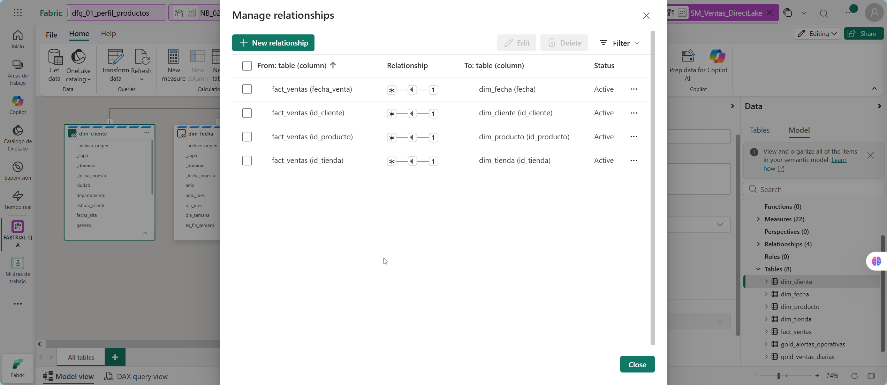
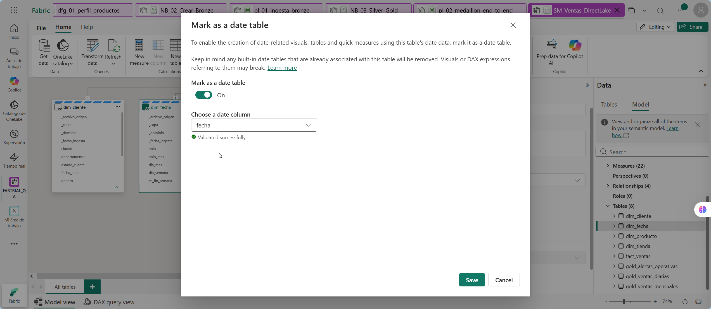
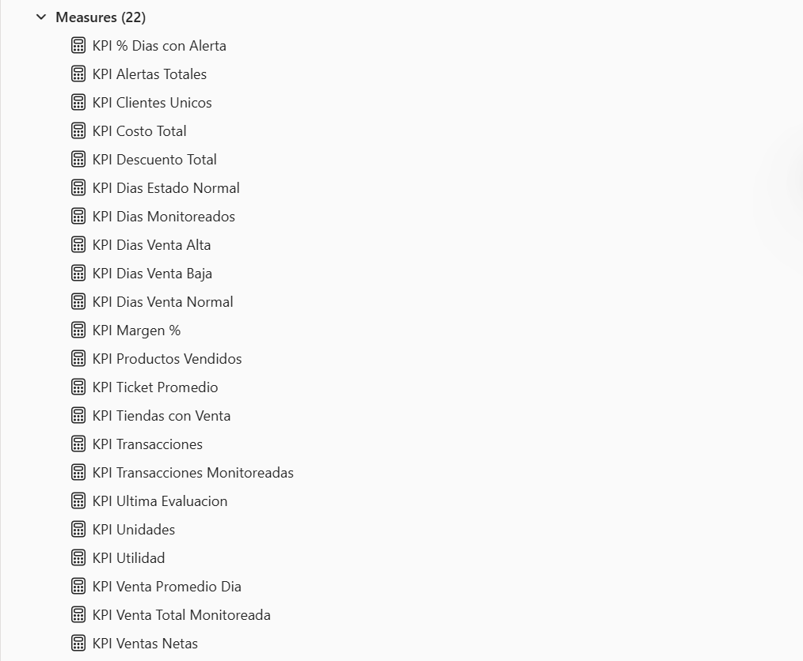
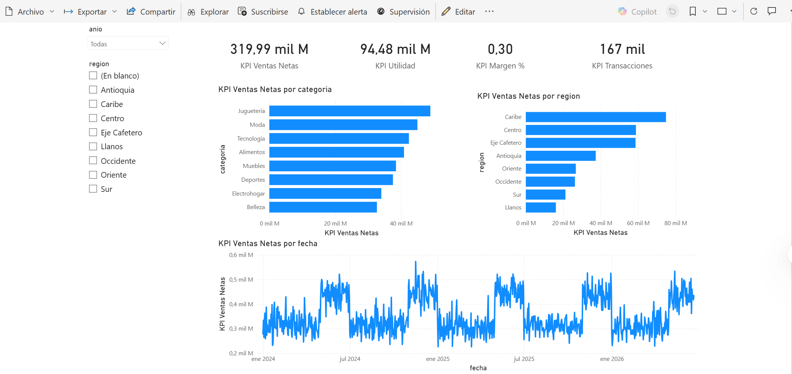
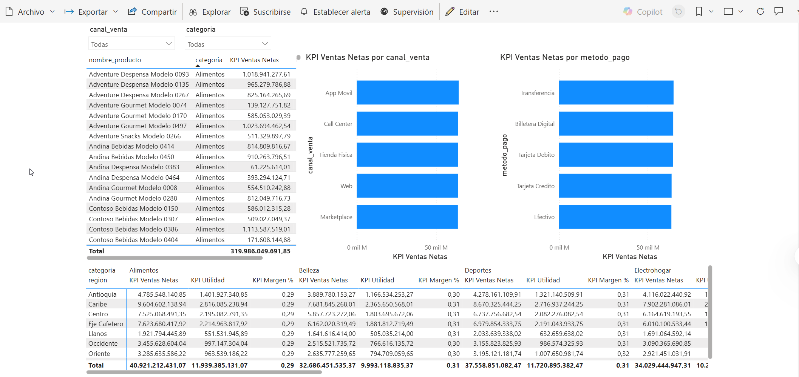
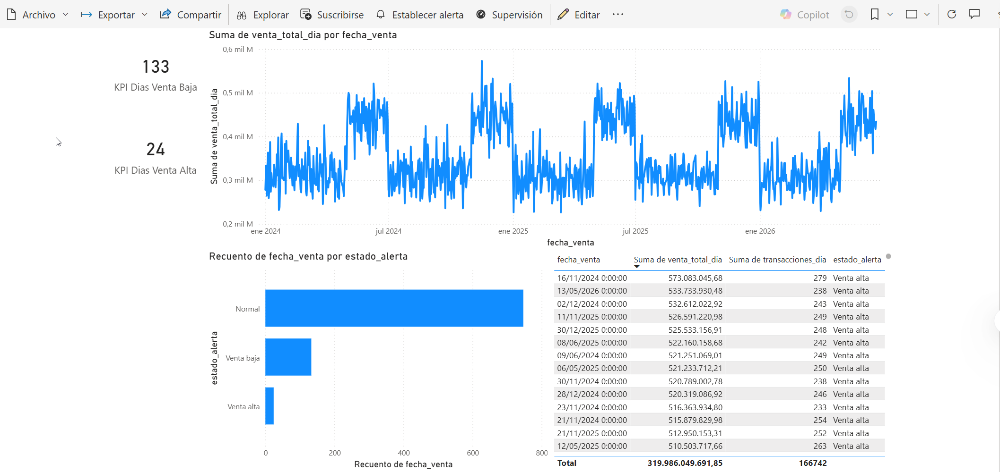
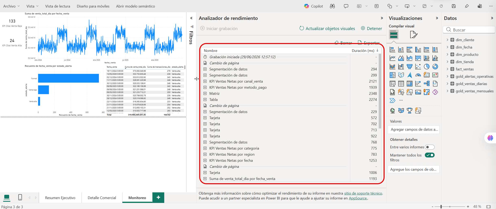

# Alta velocidad: Publicación de modelo Direct Lake y conexión a Power BI

## 1. Metadatos

| Atributo | Detalle |
|---|---|
| **Duración estimada** | 120 minutos |
| **Complejidad** | Alta |
| **Nivel Bloom** | Analizar / Crear |
| **Módulo** | Capítulo 4 - Delta Lake y Direct Lake hacia Power BI |
| **Laboratorio previo requerido** | Capítulos 1, 2 y 3 completados |
| **Tecnología principal** | Lakehouse, SQL analytics endpoint, modelo semántico Direct Lake, Power BI |
| **Produce artefactos para** | Capítulo 5 |

---

## 2. Descripción general

En este laboratorio crearás un modelo semántico de Power BI sobre las tablas Delta del Lakehouse `lh_ventas`. El objetivo es demostrar cómo Direct Lake permite consumir datos almacenados en OneLake sin tener que importarlos a un modelo tradicional ni configurar un gateway.

El flujo principal se realiza desde la interfaz de Microsoft Fabric y Power BI Service. Power BI Desktop es recomendado para practicar conexión al modelo semántico y construcción de reportes, pero no es obligatorio si tu tenant permite editar reportes en el servicio.

El laboratorio usa las tablas generadas en el Capítulo 3. No se crearán datos nuevos. Se validará el SQL endpoint, se creará un modelo semántico, se configurarán relaciones, se agregarán medidas DAX y se publicará un informe llamado `Informe_Ventas_DirectLake`.

---

## 3. Objetivos de aprendizaje

Al completar este laboratorio serás capaz de:

- Consultar tablas Delta desde el SQL analytics endpoint.
- Identificar qué tablas son adecuadas para el modelo semántico.
- Crear un modelo semántico Direct Lake desde un Lakehouse.
- Definir relaciones tipo estrella.
- Crear medidas DAX de negocio.
- Construir un reporte interactivo de ventas.
- Validar rendimiento básico con Performance Analyzer.
- Publicar o guardar el informe en el workspace.

---

## 4. Prerrequisitos

### 4.1 Artefactos requeridos del Capítulo 3

| Artefacto | Nombre esperado | Estado |
|---|---|---|
| Lakehouse | `lh_ventas` | ☐ |
| Tabla de hechos | `fact_ventas` | ☐ |
| Dimensión | `dim_fecha` | ☐ |
| Dimensión | `dim_producto` | ☐ |
| Dimensión | `dim_cliente` | ☐ |
| Dimensión | `dim_tienda` | ☐ |
| Tabla Gold | `gold_ventas_diarias` | ☐ |
| Tabla Gold | `gold_ventas_mensuales` | ☐ |
| Tabla Gold | `gold_alertas_operativas` | ☐ |

### 4.2 Software

| Software | Uso | Obligatorio |
|---|---|---|
| Microsoft Edge o Google Chrome | Fabric y Power BI Service | Sí |
| Power BI Desktop 64-bit actualizado | Conexión al modelo y edición local | Recomendado |

### 4.3 Restricciones importantes

- No uses Import mode como camino principal del taller.
- No crees un modelo con tablas Bronze.
- No cambies nombres de tablas ni columnas.
- No elimines las tablas del Capítulo 3.
- No dependas de un gateway local.

---

## 5. Resultado esperado

Al finalizar tendrás:

```text
SM_Ventas_DirectLake
Informe_Ventas_DirectLake
```

El modelo contendrá como mínimo:

```text
fact_ventas
dim_fecha
dim_producto
dim_cliente
dim_tienda
gold_ventas_diarias
gold_ventas_mensuales
gold_alertas_operativas
```

Relaciones mínimas:

```text
dim_fecha[fecha]          1:*  fact_ventas[fecha_venta]
dim_producto[id_producto] 1:*  fact_ventas[id_producto]
dim_cliente[id_cliente]   1:*  fact_ventas[id_cliente]
dim_tienda[id_tienda]     1:*  fact_ventas[id_tienda]
```

Medidas mínimas:

```text
KPI Ventas Netas
KPI Utilidad
KPI Margen %
KPI Transacciones
KPI Unidades
KPI Ticket Promedio
KPI Cumplimiento Presupuesto
KPI Dias Venta Baja
KPI Dias Venta Alta
KPI Alertas Totales
```

---

## 6. Conceptos clave

### 6.1 Direct Lake

Direct Lake permite que Power BI consuma datos Delta almacenados en OneLake con un modo optimizado. En este taller se aprovecha porque las tablas creadas en el Capítulo 3 son Delta tables registradas en `lh_ventas`.

### 6.2 SQL analytics endpoint

El SQL endpoint permite validar los datos con SQL relacional y es útil para comparar resultados contra el modelo semántico.

### 6.3 Modelo semántico

El modelo semántico define relaciones, medidas, formatos y comportamiento de análisis para los reportes. Aunque las tablas existan en Lakehouse, el usuario de negocio necesita un modelo gobernado para consumirlas correctamente.

---

## 7. Procedimiento paso a paso

---

### Paso 1 - Validar tablas desde SQL endpoint

**Objetivo:** confirmar que las tablas del Capítulo 3 están disponibles para consumo analítico.

#### Instrucciones

1. Abre el workspace `FABTRIAL_<alias>`.
2. Abre el Lakehouse `lh_ventas`.
3. Cambia a **SQL analytics endpoint**.
4. Crea una nueva consulta SQL.
5. Ejecuta:

```sql
SELECT 'fact_ventas' AS tabla, COUNT(*) AS filas FROM fact_ventas
UNION ALL SELECT 'dim_fecha', COUNT(*) FROM dim_fecha
UNION ALL SELECT 'dim_producto', COUNT(*) FROM dim_producto
UNION ALL SELECT 'dim_cliente', COUNT(*) FROM dim_cliente
UNION ALL SELECT 'dim_tienda', COUNT(*) FROM dim_tienda
UNION ALL SELECT 'gold_ventas_diarias', COUNT(*) FROM gold_ventas_diarias
UNION ALL SELECT 'gold_ventas_mensuales', COUNT(*) FROM gold_ventas_mensuales
UNION ALL SELECT 'gold_alertas_operativas', COUNT(*) FROM gold_alertas_operativas;
```

6. Ejecuta una consulta de validación de ventas:

```sql
SELECT
    COUNT(DISTINCT id_transaccion) AS transacciones,
    SUM(monto_total) AS ventas_netas,
    SUM(utilidad) AS utilidad,
    SUM(cantidad) AS unidades
FROM fact_ventas;
```

#### Resultado esperado

SQL devuelve conteos y métricas sin error.

---

### Paso 2 - Seleccionar tablas candidatas para el modelo

**Objetivo:** decidir qué tablas se usarán en Power BI.

#### Instrucciones

Usa esta selección:

| Tabla | Uso en modelo |
|---|---|
| `fact_ventas` | Tabla de hechos principal. |
| `dim_fecha` | Filtros y análisis temporal. |
| `dim_producto` | Categoría, subcategoría, marca y producto. |
| `dim_cliente` | Segmento, región de cliente y atributos de cliente. |
| `dim_tienda` | Región, ciudad, formato de tienda. |
| `gold_ventas_diarias` | Monitoreo y análisis diario agregado. |
| `gold_ventas_mensuales` | Presupuesto y cumplimiento. |
| `gold_alertas_operativas` | Base del Lab 05 para alertas. |

No incluyas tablas Bronze. Puedes incluir Silver solo si necesitas análisis exploratorio, pero no es necesario para el resultado final.

---

### Paso 3 - Crear el modelo semántico `SM_Ventas_DirectLake`

**Objetivo:** crear el modelo semántico sobre el Lakehouse.

#### Instrucciones

1. Regresa al workspace `FABTRIAL_<alias>`.
2. Abre el Lakehouse `lh_ventas`.
3. Busca la opción **New semantic model**.
4. Si Fabric muestra la opción desde el Lakehouse, selecciónala.
5. En el nombre del modelo, escribe:

   ```text
   SM_Ventas_DirectLake
   ```

6. Selecciona las tablas:

   ```text
   fact_ventas
   dim_fecha
   dim_producto
   dim_cliente
   dim_tienda
   gold_ventas_diarias
   gold_ventas_mensuales
   gold_alertas_operativas
   ```

7. Confirma la creación.
8. Espera a que se abra la experiencia de modelado o el modelo aparezca en el workspace.

#### Resultado esperado

Existe un modelo semántico llamado `SM_Ventas_DirectLake`.

#### Validación

En el workspace debe aparecer un elemento de tipo Semantic model o Power BI semantic model con ese nombre.

---

### Paso 4 - Revisar modo de almacenamiento

**Objetivo:** validar que el modelo se apoya en Direct Lake.

#### Instrucciones

1. Abre `SM_Ventas_DirectLake`.
2. Busca propiedades de una de las tablas.
3. Revisa que el modelo proviene del Lakehouse `lh_ventas`.
4. Si la interfaz muestra modo de almacenamiento, confirma que aparece **Direct Lake** o que no aparece como Import.

#### Resultado esperado

El modelo está conectado al Lakehouse sin gateway.

#### Validación

Anota:

```text
Modelo semántico: SM_Ventas_DirectLake
Origen: lh_ventas
Gateway requerido: No
Modo esperado: Direct Lake / Automatic
```

---

### Paso 5 - Configurar relaciones del modelo

**Objetivo:** construir un esquema estrella alrededor de `fact_ventas`.

#### Instrucciones

1. En el modelo semántico, abre la vista **Model** o **Relationships**.
2. Crea o valida estas relaciones:

| Desde | Hacia | Cardinalidad | Dirección de filtro |
|---|---|---|---|
| `dim_fecha[fecha]` | `fact_ventas[fecha_venta]` | Uno a varios | Single |
| `dim_producto[id_producto]` | `fact_ventas[id_producto]` | Uno a varios | Single |
| `dim_cliente[id_cliente]` | `fact_ventas[id_cliente]` | Uno a varios | Single |
| `dim_tienda[id_tienda]` | `fact_ventas[id_tienda]` | Uno a varios | Single |

3. Si Fabric creó relaciones automáticamente, revísalas una por una.
4. Elimina relaciones ambiguas si Fabric las creó con dirección Both sin necesidad.
5. Guarda los cambios.



#### Resultado esperado

El modelo tiene un esquema estrella simple y sin relaciones ambiguas.

#### Validación

En la vista de modelo, `fact_ventas` debe estar en el centro y las dimensiones alrededor.

---

### Paso 6 - Marcar tabla de fechas

**Objetivo:** habilitar inteligencia de tiempo correctamente.

#### Instrucciones

1. Selecciona la tabla `dim_fecha`.
2. Busca la opción **Mark as date table** o **Mark as date table** en las propiedades.
3. Selecciona la columna:

   ```text
   fecha
   ```

4. Guarda.



#### Resultado esperado

`dim_fecha` queda marcada como tabla de fechas.

#### Validación

La columna `fecha` tiene tipo Date y valores únicos.

---

### Paso 7 - Crear medidas DAX de negocio

**Objetivo:** agregar cálculos reutilizables al modelo semántico sin crear conflictos con columnas existentes.

#### Instrucciones

Abre **DAX View** o **DAX Query View** del modelo `SM_Ventas_DirectLake` y crea las medidas con prefijo `KPI`. El prefijo evita errores porque la tabla `fact_ventas` ya contiene columnas como `utilidad`, `cantidad` y `monto_total`.

Pega y ejecuta este bloque:

```DAX
DEFINE
    MEASURE 'fact_ventas'[KPI Ventas Netas] =
        SUM('fact_ventas'[monto_total])

    MEASURE 'fact_ventas'[KPI Venta Bruta] =
        SUM('fact_ventas'[monto_bruto])

    MEASURE 'fact_ventas'[KPI Descuento] =
        SUM('fact_ventas'[monto_descuento])

    MEASURE 'fact_ventas'[KPI Utilidad] =
        SUM('fact_ventas'[utilidad])

    MEASURE 'fact_ventas'[KPI Margen %] =
        DIVIDE([KPI Utilidad], [KPI Ventas Netas])

    MEASURE 'fact_ventas'[KPI Transacciones] =
        DISTINCTCOUNT('fact_ventas'[id_transaccion])

    MEASURE 'fact_ventas'[KPI Unidades] =
        SUM('fact_ventas'[cantidad])

    MEASURE 'fact_ventas'[KPI Ticket Promedio] =
        DIVIDE([KPI Ventas Netas], [KPI Transacciones])

    MEASURE 'fact_ventas'[KPI Costo Total] =
        SUM('fact_ventas'[costo_total])

    MEASURE 'fact_ventas'[KPI Clientes Unicos] =
        DISTINCTCOUNT('fact_ventas'[id_cliente])

    MEASURE 'fact_ventas'[KPI Productos Vendidos] =
        DISTINCTCOUNT('fact_ventas'[id_producto])

    MEASURE 'fact_ventas'[KPI Tiendas con Venta] =
        DISTINCTCOUNT('fact_ventas'[id_tienda])

    MEASURE 'gold_ventas_mensuales'[KPI Presupuesto Venta] =
        SUM('gold_ventas_mensuales'[presupuesto_venta])

    MEASURE 'gold_ventas_mensuales'[KPI Cumplimiento Presupuesto] =
        DIVIDE(SUM('gold_ventas_mensuales'[venta_neta]), [KPI Presupuesto Venta])

    MEASURE 'gold_alertas_operativas'[KPI Dias Monitoreados] =
        COUNTROWS('gold_alertas_operativas')

    MEASURE 'gold_alertas_operativas'[KPI Dias Estado Normal] =
        CALCULATE(
            COUNTROWS('gold_alertas_operativas'),
            'gold_alertas_operativas'[estado_alerta] = "Normal"
        )

    MEASURE 'gold_alertas_operativas'[KPI Dias Venta Baja] =
        CALCULATE(
            COUNTROWS('gold_alertas_operativas'),
            'gold_alertas_operativas'[estado_alerta] = "Venta baja"
        )

    MEASURE 'gold_alertas_operativas'[KPI Dias Venta Alta] =
        CALCULATE(
            COUNTROWS('gold_alertas_operativas'),
            'gold_alertas_operativas'[estado_alerta] = "Venta alta"
        )

    MEASURE 'gold_alertas_operativas'[KPI Alertas Totales] =
        [KPI Dias Venta Baja] + [KPI Dias Venta Alta]

    MEASURE 'gold_alertas_operativas'[KPI % Dias con Alerta] =
        DIVIDE([KPI Alertas Totales], [KPI Dias Monitoreados])

EVALUATE
ROW(
    "Ventas Netas", [KPI Ventas Netas],
    "Utilidad", [KPI Utilidad],
    "Margen %", [KPI Margen %],
    "Transacciones", [KPI Transacciones],
    "Unidades", [KPI Unidades],
    "Dias Venta Baja", [KPI Dias Venta Baja],
    "Dias Venta Alta", [KPI Dias Venta Alta],
    "Alertas Totales", [KPI Alertas Totales]
)
```

Después de ejecutar, selecciona **Update model** o **Add measures to model** para guardar las medidas en el modelo semántico.

#### Resultado esperado

Las medidas aparecen disponibles en el panel de campos con prefijo `KPI`.

#### Validación

Los valores principales sin filtros deben ser:

| Medida | Valor esperado |
|---|---:|
| `KPI Ventas Netas` | 319.986.049.691,85 |
| `KPI Utilidad` | 94.481.899.491,85 |
| `KPI Margen %` | 29,53 % |
| `KPI Transacciones` | 166.742 |
| `KPI Unidades` | 262.140 |
| `KPI Dias Venta Baja` | 133 |
| `KPI Dias Venta Alta` | 24 |
| `KPI Alertas Totales` | 157 |

---

### Paso 8 - Configurar formatos

**Objetivo:** mejorar la lectura del reporte.

#### Instrucciones

Configura formatos:

| Medida | Formato requerido |
|---|---|
| `KPI Ventas Netas` | Moneda, COP, sin decimales o con separador de miles. |
| `KPI Venta Bruta` | Moneda. |
| `KPI Descuento` | Moneda. |
| `KPI Utilidad` | Moneda. |
| `KPI Margen %` | Porcentaje, 2 decimales. |
| `KPI Ticket Promedio` | Moneda. |
| `KPI Cumplimiento Presupuesto` | Porcentaje, 2 decimales. |
| `KPI Transacciones` | Número entero. |
| `KPI Unidades` | Número entero. |
| `KPI Dias Monitoreados` | Número entero. |
| `KPI Dias Venta Baja` | Número entero. |
| `KPI Dias Venta Alta` | Número entero. |
| `KPI Alertas Totales` | Número entero. |
| `KPI % Dias con Alerta` | Porcentaje, 2 decimales. |



#### Resultado esperado

Las visualizaciones muestran formatos adecuados.

---

### Paso 9 - Crear el informe `Informe_Ventas_DirectLake`

**Objetivo:** construir un reporte de negocio sobre el modelo.

#### Instrucciones desde Power BI Service

1. Desde el modelo `SM_Ventas_DirectLake`, selecciona **Create report**.
2. Si Fabric pregunta si quieres crear un reporte nuevo, confirma.
3. Guarda el reporte con el nombre:

   ```text
   Informe_Ventas_DirectLake
   ```

#### Instrucciones desde Power BI Desktop, si lo usas

1. Abre Power BI Desktop.
2. Selecciona **Get data**.
3. Busca **Power BI semantic models** o **OneLake data hub**.
4. Selecciona el workspace `FABTRIAL_<alias>`.
5. Elige `SM_Ventas_DirectLake`.
6. Conéctate en modo Live connection.
7. Construye el reporte.
8. Publica en el workspace con el nombre `Informe_Ventas_DirectLake`.

#### Resultado esperado

Existe un reporte conectado al modelo semántico.

---

### Paso 10 - Construir página 1: Resumen Ejecutivo

**Objetivo:** mostrar indicadores ejecutivos de venta.

#### Instrucciones

Crea una página llamada:

```text
Resumen Ejecutivo
```

Agrega estos visuales obligatorios:

| Visual | Campos |
|---|---|
| Tarjeta | `KPI Ventas Netas` |
| Tarjeta | `KPI Utilidad` |
| Tarjeta | `KPI Margen %` |
| Tarjeta | `KPI Transacciones` |
| Tarjeta | `KPI Unidades` |
| Línea | Eje: `dim_fecha[fecha]`; Valores: `KPI Ventas Netas` |
| Barras | Eje: `dim_producto[categoria]`; Valores: `KPI Ventas Netas` |
| Barras | Eje: `dim_tienda[region]`; Valores: `KPI Ventas Netas` |
| Segmentador | `dim_fecha[anio]` |
| Segmentador | `dim_tienda[region]` |



#### Resultado esperado

La página permite filtrar ventas por año y región.

#### Validación

Al cambiar un segmentador, las tarjetas y gráficos se actualizan.

---

### Paso 11 - Construir página 2: Detalle Comercial

**Objetivo:** analizar ventas por región, categoría, canal y producto.

#### Instrucciones

Crea una página llamada:

```text
Detalle Comercial
```

Agrega estos visuales obligatorios:

| Visual | Campos |
|---|---|
| Matriz | Filas: `dim_tienda[region]`; Columnas: `dim_producto[categoria]`; Valores: `KPI Ventas Netas`, `KPI Utilidad`, `KPI Margen %` |
| Tabla | `dim_producto[nombre_producto]`, `dim_producto[categoria]`, `KPI Ventas Netas`, `KPI Unidades` |
| Barras | Eje: `fact_ventas[canal_venta]`; Valores: `KPI Ventas Netas` |
| Barras | Eje: `fact_ventas[metodo_pago]`; Valores: `KPI Ventas Netas` |
| Segmentador | `dim_producto[categoria]` |
| Segmentador | `fact_ventas[canal_venta]` |



#### Resultado esperado

La página permite identificar categorías y canales con mayor contribución.

---

### Paso 12 - Construir página 3: Monitoreo

**Objetivo:** preparar la base visual para el Capítulo 5.

#### Instrucciones

Crea una página llamada:

```text
Monitoreo
```

Agrega estos visuales obligatorios:

| Visual | Campos |
|---|---|
| Tarjeta | `KPI Dias Venta Baja` |
| Tarjeta | `KPI Dias Venta Alta` |
| Tarjeta | `KPI Alertas Totales` |
| Línea | Eje: `gold_alertas_operativas[fecha_venta]`; Valores: `gold_alertas_operativas[venta_total_dia]` |
| Barras | Eje: `gold_alertas_operativas[estado_alerta]`; Valores: recuento de `fecha_venta` |
| Tabla | `gold_alertas_operativas[fecha_venta]`, `gold_alertas_operativas[venta_total_dia]`, `gold_alertas_operativas[transacciones_dia]`, `gold_alertas_operativas[umbral_bajo]`, `gold_alertas_operativas[umbral_alto]`, `gold_alertas_operativas[estado_alerta]` |



#### Resultado esperado

La página muestra días normales, días con venta baja y días con venta alta.

#### Validación

Las tarjetas deben mostrar estos valores sin filtros:

| Medida | Valor esperado |
|---|---:|
| `KPI Dias Venta Baja` | 133 |
| `KPI Dias Venta Alta` | 24 |
| `KPI Alertas Totales` | 157 |

Esta página se usará para probar alertas en el Capítulo 5.

---

### Paso 13 - Guardar el reporte

**Objetivo:** dejar el reporte disponible en el workspace.

#### Instrucciones

1. Selecciona **Save**.
2. Usa el nombre:

   ```text
   Informe_Ventas_DirectLake
   ```

3. Confirma que el reporte aparece en el workspace.
4. Si trabajaste en Power BI Desktop, selecciona **Publish** y elige el workspace `FABTRIAL_<alias>`.

#### Resultado esperado

El reporte queda publicado o guardado en el workspace.

---

### Paso 14 - Validar métricas contra SQL

**Objetivo:** confirmar que Power BI coincide con el Lakehouse.

#### Instrucciones

1. Compara las tarjetas de Power BI con la consulta SQL del Paso 1.
2. Revisa `KPI Ventas Netas`, `KPI Utilidad`, `KPI Transacciones` y `KPI Unidades`.
3. Si hay diferencias, revisa si tienes filtros activos en el reporte.
4. Limpia filtros y compara nuevamente.

#### Resultado esperado

Las métricas coinciden cuando no hay filtros activos.

---

### Paso 15 - Analizar rendimiento con Performance Analyzer

**Objetivo:** observar el comportamiento del reporte.

#### Instrucciones

1. En Power BI Service, en **View**
2. Selecciona **Performance Analyzer**.
3. Selecciona **Start recording**.
4. Interactúa con el reporte.
5. Selecciona **Refresh visuals**.
6. Observa tiempos de carga de visuales.



#### Resultado esperado

Los visuales responden de forma fluida para el volumen del taller.

---

## 8. Validación general del laboratorio

| Validación | Estado |
|---|---|
| El SQL endpoint consulta `fact_ventas`. | ☐ |
| Existe `SM_Ventas_DirectLake`. | ☐ |
| El modelo usa tablas del Lakehouse `lh_ventas`. | ☐ |
| Existen relaciones de dimensiones hacia `fact_ventas`. | ☐ |
| Existen medidas DAX mínimas. | ☐ |
| Existe `Informe_Ventas_DirectLake`. | ☐ |
| El reporte tiene página Resumen Ejecutivo. | ☐ |
| El reporte tiene página Detalle Comercial. | ☐ |
| El reporte tiene página Monitoreo. | ☐ |
| Las métricas coinciden con SQL sin filtros. | ☐ |

---

## 9. Errores frecuentes y solución

### Problema 1 - No aparece la opción de modelo semántico

**Causa probable:** estás en el Lakehouse equivocado, la capacidad Trial no está asignada o la interfaz cambió.

**Solución:**

1. Confirma que estás en `lh_ventas`.
2. Revisa que el workspace está en Trial.
3. Busca la opción desde el workspace: **+ New item > Semantic model**.
4. Si no aparece, solicita al instructor validar permisos.

---

### Problema 2 - El modelo se crea sin algunas tablas

**Causa probable:** no seleccionaste todas las tablas al crear el modelo.

**Solución:**

1. Edita el modelo y agrega las tablas faltantes.
2. Si no se pueden agregar, recrea el modelo seleccionando todas las tablas desde el inicio.

---

### Problema 3 - Las relaciones se crean incorrectamente

**Causa probable:** Power BI inferió relaciones ambiguas.

**Solución:**

1. Elimina relaciones incorrectas.
2. Crea manualmente las cuatro relaciones del esquema estrella.
3. Usa dirección de filtro Single desde dimensión hacia hecho.

---

### Problema 4 - Las medidas muestran valores en blanco

**Causa probable:** filtros activos o columnas mal seleccionadas.

**Solución:**

1. Limpia filtros del reporte.
2. Verifica que las medidas usan `fact_ventas` y no tablas Bronze.
3. Revisa que `monto_total`, `utilidad` y `cantidad` son numéricos.

---

### Problema 5 - El reporte en Power BI Desktop aparece como Live connection y no permite modelar

**Causa probable:** estás conectado a un semantic model publicado.

**Solución:**

Eso es esperado si usas conexión al modelo semántico. Las relaciones y medidas deben editarse en el modelo semántico de Fabric o mediante experiencia de modelado remoto si está habilitada.

---

## 10. Validación de cierre

Antes de continuar al siguiente capítulo, confirma:

1. El modelo semántico muestra las relaciones activas esperadas.
2. Las medidas DAX con prefijo `KPI` existen en el modelo.
3. El reporte contiene la página **Resumen Ejecutivo**.
4. El reporte contiene la página **Detalle Comercial**.
5. El reporte contiene la página **Monitoreo**.
6. Los valores principales del reporte coinciden con las métricas validadas en SQL.

---

## 11. Cierre del laboratorio

En este capítulo conectaste la arquitectura Lakehouse con Power BI usando un modelo semántico optimizado para Direct Lake. El reporte resultante será la base para activar monitoreo y alertas en el Capítulo 5.

---

## 12. Preguntas de reflexión

1. ¿Por qué el modelo semántico debe consumir tablas Gold o fact/dim y no Bronze?
2. ¿Qué ventaja ofrece Direct Lake frente a Import para datos en OneLake?
3. ¿Qué problemas evita un modelo estrella bien definido?
4. ¿Por qué conviene comparar Power BI contra SQL endpoint?
5. ¿Qué visual del reporte sería más útil para crear una alerta operacional?

