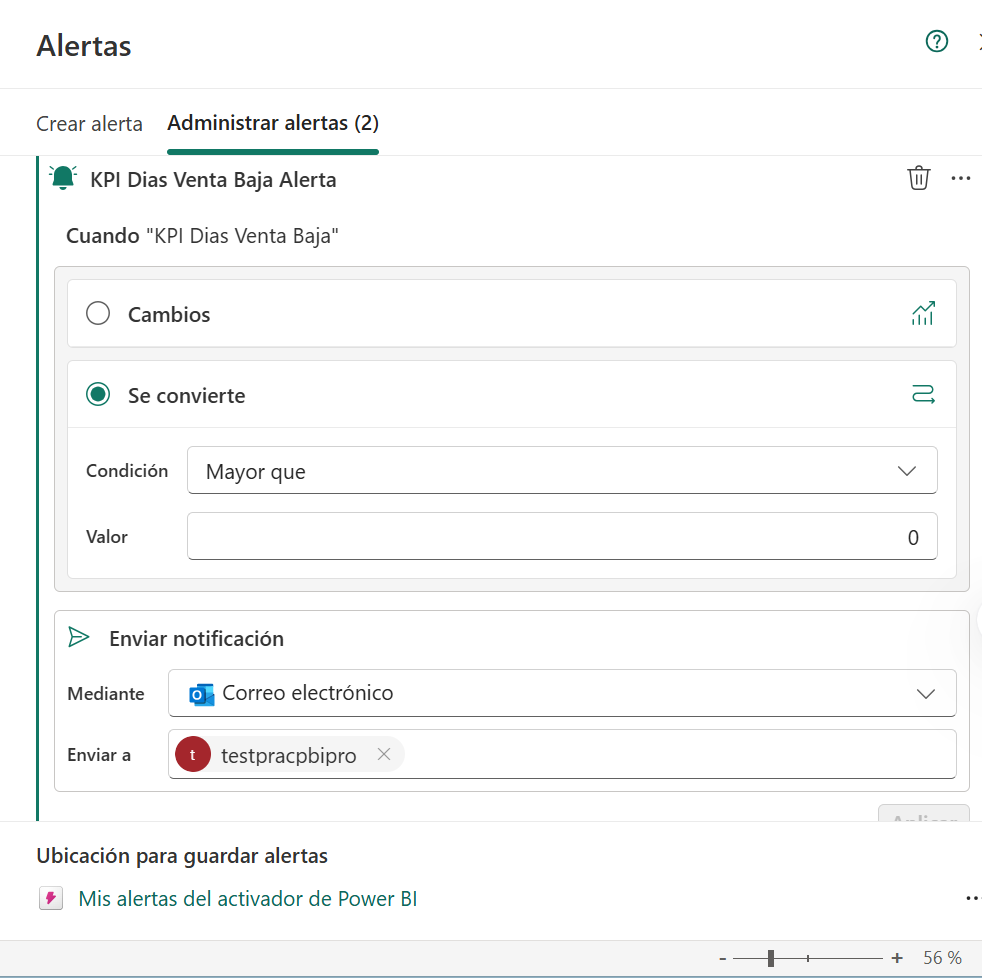
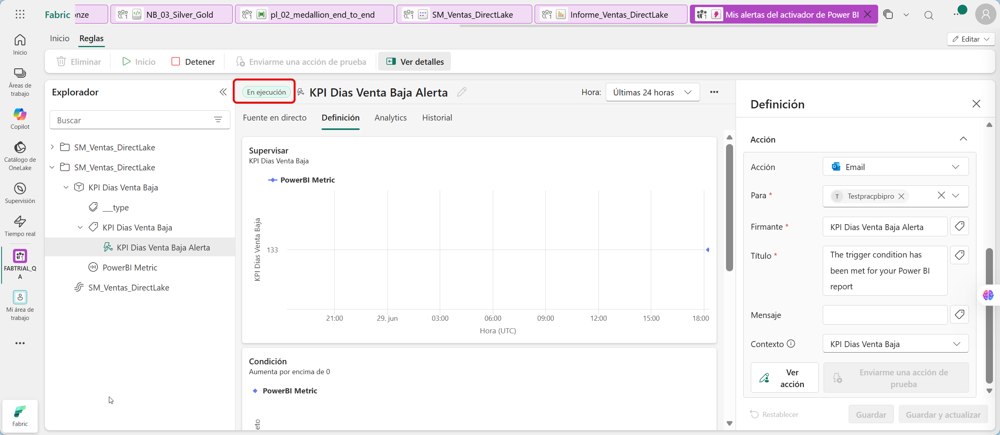
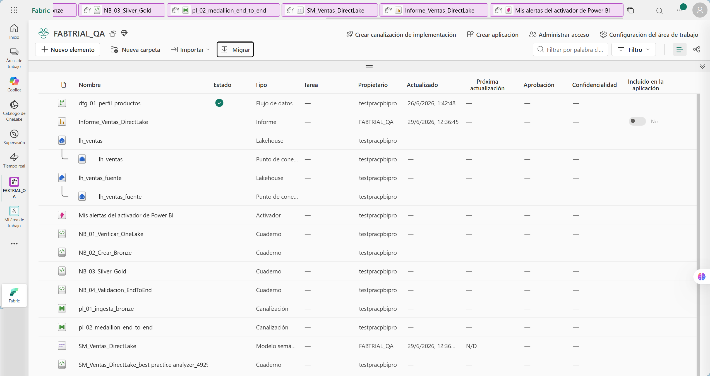

# Eficiencia operativa: Configuración de alerta automática basada en eventos

## 1. Metadatos

| Atributo | Detalle |
|---|---|
| **Duración estimada** | 75 minutos |
| **Complejidad** | Media |
| **Nivel Bloom** | Aplicar / Analizar |
| **Módulo** | Capítulo 5 - Automatización y Monitoreo Inteligente |
| **Laboratorio previo requerido** | Capítulos 1, 2, 3 y 4 completados |
| **Tecnología principal** | Power BI report alerts y Fabric Activator |
| **Cierre del taller** | Sí |

---

## 2. Descripción general

Este laboratorio cierra el ciclo de la arquitectura moderna implementada durante el taller. Configurarás alertas sobre el reporte `Informe_Ventas_DirectLake`, usando medidas y visuales construidos en el Capítulo 4 y datos de monitoreo generados en la tabla `gold_alertas_operativas`.

El objetivo principal es comprender el patrón de monitoreo, revisar la salud básica de las ejecuciones en Fabric y configurar una alerta en Fabric Activator desde un reporte de Power BI. La notificación mínima del laboratorio se realizará con las opciones disponibles en el tenant, priorizando email cuando esté habilitado.

> La disponibilidad de Activator y del botón **Set alert** puede depender de configuración del tenant, permisos y experiencia habilitada en la región. Por eso el laboratorio incluye una validación principal y una validación alternativa.

---

## 3. Objetivos de aprendizaje

Al completar este laboratorio serás capaz de:

- Validar una tabla de monitoreo en el Lakehouse.
- Identificar métricas de negocio aptas para alertas.
- Configurar una alerta desde un visual de Power BI.
- Guardar o asociar la alerta a un artefacto Activator.
- Revisar reglas en Fabric Activator.
- Revisar Monitor Hub para validar ejecuciones, duración y estado de pipelines/notebooks.
- Probar una condición de alerta con datos existentes.
- Documentar un runbook operativo básico.
- Entender limitaciones de Trial, tenant y permisos.

---

## 4. Prerrequisitos

### 4.1 Artefactos requeridos

| Artefacto | Nombre esperado | Estado |
|---|---|---|
| Workspace | `FABTRIAL_<alias>` | ☐ |
| Lakehouse | `lh_ventas` | ☐ |
| Tabla de monitoreo | `gold_alertas_operativas` | ☐ |
| Modelo semántico | `SM_Ventas_DirectLake` | ☐ |
| Reporte | `Informe_Ventas_DirectLake` | ☐ |
| Página de reporte | `Monitoreo` | ☐ |
| Medida | `KPI Dias Venta Baja` | ☐ |
| Medida | `KPI Dias Venta Alta` | ☐ |

### 4.2 Permisos requeridos

| Permiso | Por qué se requiere |
|---|---|
| Editar el reporte | Para ver y configurar el botón **Set alert**. |
| Workspace en capacidad Fabric | Activator requiere un workspace con capacidad habilitada. |
| Permiso para crear elementos | Para crear o asociar el Activator item. |
| Tenant setting habilitado | El administrador puede habilitar o bloquear alertas desde Power BI. |

### 4.3 Servicios opcionales

| Servicio | Estado en este taller |
|---|---|
| Email | Recomendado para notificación básica. |
| Otros canales de notificación | Opcionales. No bloquean el laboratorio. |

---

## 5. Resultado esperado

Al finalizar tendrás:

```text
ACT_Monitoreo_Ventas
```

O un Activator item creado automáticamente por Power BI con una regla activa sobre el reporte `Informe_Ventas_DirectLake`.

La regla mínima del laboratorio será:

```text
Si KPI Dias Venta Baja > 0
entonces enviar notificación por email.
```

También documentarás un runbook operativo básico con responsables, umbrales, acciones sugeridas y una verificación técnica del estado de pipelines/notebooks.

---

## 6. Conceptos clave

### 6.1 Monitoreo de negocio vs. monitoreo técnico

| Tipo | Ejemplo en este taller |
|---|---|
| Monitoreo de negocio | Días con venta baja, venta diaria por debajo del umbral. |
| Monitoreo técnico | Pipeline sin ejecución exitosa, Dataflow fallido, notebook con error o tablas sin actualización. |

Este laboratorio prioriza monitoreo de negocio desde Power BI porque es el camino más fluido para participantes. Además, agrega una revisión técnica corta en Monitor Hub para conectar el estado de los procesos con la operación del Lakehouse.

### 6.2 Tabla de soporte `gold_alertas_operativas`

La tabla se creó en el Capítulo 3. Contiene una fila por fecha y clasifica el estado del día:

```text
Normal
Venta baja
Venta alta
```

Columnas principales:

```text
fecha_venta
venta_total_dia
transacciones_dia
umbral_bajo
umbral_alto
estado_alerta
fecha_evaluacion
```

### 6.3 Condición de prueba

La condición `KPI Dias Venta Baja > 0` se usa porque el dataset ya contiene días clasificados como `Venta baja`, lo cual permite validar la regla sin modificar datos.

### 6.4 Monitoreo técnico mínimo del taller

Además de alertas de negocio, el cierre del taller debe demostrar que el participante sabe revisar la salud operativa básica de la solución.

| Elemento | Qué revisar |
|---|---|
| Pipeline `pl_01_ingesta_bronze` | Última ejecución, estado, duración y detalle de actividades. |
| Pipeline `pl_02_medallion_end_to_end` | Ejecución del notebook Silver/Gold y errores si aparecen. |
| Notebooks | Estado del job Spark, duración aproximada y salida de validación. |
| Dataflow Gen2 `dfg_01_perfil_productos` | Último refresh y estado, si se creó en el Capítulo 2. |
| SQL endpoint | Que las tablas finales sean consultables. |
| Modelo/reporte | Que el reporte abra sin errores y las medidas respondan a filtros. |

Este monitoreo se realiza desde **Monitor Hub**, historial de ejecución de elementos y validaciones SQL. Si el instructor tiene permisos administrativos, puede complementar con métricas de capacidad, pero no es requisito para los participantes.

---

## 7. Procedimiento paso a paso

### Paso 1 - Validar la tabla de monitoreo en SQL endpoint

**Objetivo:** confirmar que existen datos para activar alertas.

#### Instrucciones

1. Abre el workspace `FABTRIAL_<alias>`.
2. Abre el Lakehouse `lh_ventas`.
3. Cambia a **SQL analytics endpoint**.
4. Ejecuta:

```sql
SELECT
    estado_alerta,
    COUNT(*) AS dias,
    MIN(fecha_venta) AS primera_fecha,
    MAX(fecha_venta) AS ultima_fecha
FROM gold_alertas_operativas
GROUP BY estado_alerta
ORDER BY dias DESC;
```

5. Ejecuta también:

```sql
SELECT TOP 20
    fecha_venta,
    venta_total_dia,
    transacciones_dia,
    umbral_bajo,
    umbral_alto,
    estado_alerta
FROM gold_alertas_operativas
WHERE estado_alerta <> 'Normal'
ORDER BY fecha_venta DESC;
```

#### Resultado esperado

Debe existir al menos un grupo `Venta baja` y posiblemente `Venta alta`.

---

### Paso 2 - Abrir el reporte en modo edición

**Objetivo:** preparar el visual desde el cual se creará la alerta.

#### Instrucciones

1. Regresa al workspace `FABTRIAL_<alias>`.
2. Abre el reporte:

   ```text
   Informe_Ventas_DirectLake
   ```

3. Selecciona **Edit** o **Editar**.
4. Abre la página:

   ```text
   Monitoreo
   ```

5. Confirma que existen las tarjetas:

   ```text
   Dias Venta Baja
   Dias Venta Alta
   ```

#### Resultado esperado

El reporte se abre en modo edición y se ve la página Monitoreo.

#### Validación

La tarjeta `KPI Dias Venta Baja` debe mostrar un número mayor que cero.

---

### Paso 3 - Crear la alerta desde el reporte

**Objetivo:** configurar una regla Activator desde Power BI.

#### Instrucciones

1. Con la tarjeta `KPI Dias Venta Baja` seleccionada, busca el botón **Set alert** en la cinta superior.
2. Si no aparece en la cinta, abre el menú de tres puntos del visual y busca **Set alert**, **Add alert** o **Establecer alerta**.
3. Selecciona **Set alert**.
4. Si Fabric abre el panel de alertas, selecciona **Add alert**.
5. En ubicación de guardado, selecciona el workspace:

   ```text
   FABTRIAL_<alias>
   ```

6. Si puedes crear un nuevo Activator item, usa el nombre:

   ```text
   ACT_Monitoreo_Ventas
   ```

7. Configura la condición:

   ```text
   KPI Dias Venta Baja becomes greater than 0
   ```

8. Configura la acción de notificación por email.
9. Usa tu propio usuario como destinatario.
10. Guarda o aplica la alerta.



#### Resultado esperado

Fabric confirma que la alerta fue creada.

#### Validación

El panel de alertas muestra la regla creada y asociada al reporte o al Activator item.

---

### Paso 4 - Abrir la alerta en Fabric Activator

**Objetivo:** revisar la regla en Activator.

#### Instrucciones

1. Regresa al workspace `FABTRIAL_<alias>`.
2. Busca el artefacto:

   ```text
   ACT_Monitoreo_Ventas
   ```

   Si no aparece con ese nombre, busca un elemento de tipo Activator creado automáticamente.

3. Abre el artefacto.
4. Revisa el panel de objetos, propiedades y reglas.
5. Localiza la regla asociada a `KPI Dias Venta Baja`.
6. Confirma que la condición está activa.



#### Resultado esperado

La regla aparece dentro de Activator y está en estado activo.

---

### Paso 6 - Probar la condición con datos existentes

**Objetivo:** validar que la regla usa una condición que se cumple.

#### Instrucciones

1. Vuelve al reporte `Informe_Ventas_DirectLake`.
2. Abre la página **Monitoreo**.
3. Confirma que `KPI Dias Venta Baja` es mayor que cero.
4. El valor esperado es `133`, por lo tanto la condición `133 > 0` es verdadera.
5. En Activator, revisa si la regla indica condición satisfecha o próxima evaluación.
6. Si hay botón de prueba o envío de prueba, úsalo.
7. Espera unos minutos para la notificación.

#### Resultado esperado

La condición del visual es verdadera porque existen días con venta baja.

#### Validación

No todos los tenants envían la notificación inmediatamente. La validación principal del laboratorio es que la regla queda creada y activa con una condición válida.

---

### Paso 7 - Crear una segunda alerta opcional para venta alta

**Objetivo:** practicar una condición complementaria.

#### Instrucciones opcionales

1. Selecciona la tarjeta `KPI Dias Venta Alta`.
2. Crea una alerta con condición:

   ```text
   KPI Dias Venta Alta > 0
   ```

3. Guarda la alerta en el mismo Activator item.
4. Configura notificación por email.

#### Resultado esperado

El Activator item contiene dos reglas:

```text
KPI Dias Venta Baja > 0
KPI Dias Venta Alta > 0
```

---

### Paso 8 - Revisar Monitor Hub y salud básica del flujo

**Objetivo:** confirmar que la solución no solo tiene una alerta de negocio, sino también ejecuciones técnicas trazables.

#### Instrucciones

1. En el menú izquierdo de Fabric, selecciona **Monitor** o **Monitoring hub**.
2. Filtra por el workspace:

   ```text
   FABTRIAL_<alias>
   ```

3. Busca la ejecución más reciente del pipeline:

   ```text
   pl_01_ingesta_bronze
   ```

4. Abre el detalle y valida:

   - Estado final.
   - Hora de inicio.
   - Duración.
   - Actividades ejecutadas.
   - Mensajes de error, si existen.

5. Busca ejecuciones relacionadas con:

   ```text
   NB_02_Crear_Bronze
   NB_03_Silver_Gold
   pl_02_medallion_end_to_end
   dfg_01_perfil_productos
   ```

6. Regresa al workspace y confirma que los artefactos críticos siguen disponibles:

   ```text
   lh_ventas_fuente
   lh_ventas
   pl_01_ingesta_bronze
   NB_02_Crear_Bronze
   NB_03_Silver_Gold
   SM_Ventas_DirectLake
   Informe_Ventas_DirectLake
   ```

#### Resultado esperado

Puedes demostrar que las ejecuciones principales del taller existen, terminaron correctamente o tienen una causa documentada si hubo error.

---

### Paso 8A - Revisar integración opcional con Teams

**Objetivo:** conocer la extensión, sin hacerla obligatoria.

#### Instrucciones opcionales

1. En la regla de Activator, busca **Add action**.
2. Si aparece **Microsoft Teams**, selecciónalo.
3. Configura un chat o canal permitido por tu organización.
4. Guarda.
5. Si Teams no aparece, no afecta el cumplimiento del laboratorio.

#### Resultado esperado

Teams queda configurado solo si el tenant lo permite.

---

### Paso 9 - Documentar runbook operativo

**Objetivo:** convertir la alerta en un procedimiento operativo.

#### Instrucciones

Crea una nota o documento con esta estructura:

```markdown
# Runbook Operativo - Monitoreo de Ventas

## 1. Objetivo
Detectar días con venta baja o venta alta para revisión comercial temprana.

## 2. Fuentes de datos
- Lakehouse: lh_ventas
- Tabla: gold_alertas_operativas
- Modelo semántico: SM_Ventas_DirectLake
- Reporte: Informe_Ventas_DirectLake
- Activator: ACT_Monitoreo_Ventas

## 3. Reglas configuradas
| Regla | Condición | Acción | Responsable |
|---|---|---|---|
| A01 - Días con venta baja | KPI Dias Venta Baja > 0 | Email | Analista BI |
| A02 - Días con venta alta | KPI Dias Venta Alta > 0 | Email opcional | Analista BI |

## 4. Interpretación
Venta baja indica días por debajo del umbral calculado con promedio menos desviación estándar.
Venta alta indica días por encima del promedio más dos desviaciones estándar.

## 5. Acción recomendada
1. Abrir el reporte.
2. Filtrar por días con alerta.
3. Revisar región, canal y categoría.
4. Confirmar si existe causa comercial, operativa o de datos.
5. Registrar hallazgo.

## 6. Monitoreo técnico
Revisar en Monitor Hub que `pl_01_ingesta_bronze` y `pl_02_medallion_end_to_end` tengan ejecuciones recientes en estado Succeeded. Si falla un pipeline, abrir el detalle del run, identificar la actividad fallida y revisar logs antes de reejecutar.

## 7. Escalación
Si la alerta se repite durante tres días consecutivos o falla dos veces el mismo pipeline, escalar al responsable comercial o técnico según corresponda.
```

#### Resultado esperado

Tienes un runbook simple, conectado al sistema construido.

---

### Paso 10 - Validación final del taller completo

**Objetivo:** comprobar que todos los capítulos están conectados.

#### Instrucciones

En el SQL endpoint de `lh_ventas`, ejecuta:

```sql
SELECT 'bronze_ventas' AS elemento, COUNT(*) AS filas FROM bronze_ventas
UNION ALL SELECT 'silver_ventas', COUNT(*) FROM silver_ventas
UNION ALL SELECT 'fact_ventas', COUNT(*) FROM fact_ventas
UNION ALL SELECT 'gold_ventas_diarias', COUNT(*) FROM gold_ventas_diarias
UNION ALL SELECT 'gold_ventas_mensuales', COUNT(*) FROM gold_ventas_mensuales
UNION ALL SELECT 'gold_alertas_operativas', COUNT(*) FROM gold_alertas_operativas;
```

Luego revisa en el workspace que existan:

```text
lh_ventas_fuente
lh_ventas
NB_01_Verificar_OneLake
NB_02_Crear_Bronze
NB_03_Silver_Gold
dfg_01_perfil_productos
pl_01_ingesta_bronze
pl_02_medallion_end_to_end
SM_Ventas_DirectLake
Informe_Ventas_DirectLake
ACT_Monitoreo_Ventas o Activator item equivalente
```

#### Resultado esperado

Todos los artefactos existen y se puede explicar el flujo end-to-end.

---

## 8. Validación general del laboratorio

| Validación | Estado |
|---|---|
| `gold_alertas_operativas` tiene datos. | ☐ |
| El reporte tiene página Monitoreo. | ☐ |
| La tarjeta `KPI Dias Venta Baja` muestra valor mayor a cero. | ☐ |
| Se intentó crear alerta desde Power BI. | ☐ |
| Existe regla activa o se aplicó la validación alternativa indicada. | ☐ |
| Se creó runbook operativo. | ☐ |
| Se revisó Monitor Hub y se documentó salud básica del flujo. | ☐ |
| Se validó el flujo completo desde Bronze hasta Power BI. | ☐ |

---

## 9. Errores frecuentes y solución

### Problema 1 - No aparece `ACT_Monitoreo_Ventas`

**Causa probable:** Power BI creó un Activator item con nombre automático.

**Solución:** busca en el workspace elementos de tipo Activator o Reflex. Abre el más reciente y verifica si contiene la regla.

---

### Problema 2 - La alerta no envía email inmediatamente

**Causa probable:** frecuencia de evaluación, configuración de notificaciones o políticas del tenant.

**Solución:** valida primero que la regla está activa. Revisa spam, bandeja de otros, y políticas de notificación. No repitas reglas innecesariamente.

---

### Problema 3 - La medida `KPI Dias Venta Baja` muestra cero

**Causa probable:** filtros activos en reporte.

**Solución:** limpia filtros de página y reporte. Verifica la tabla `gold_alertas_operativas` con SQL.

---

### Problema 4 - Teams no aparece como acción

**Causa probable:** integración no habilitada o permisos insuficientes.

**Solución:** usa email. Teams es opcional.

---

## 10. Validación de cierre

Antes de finalizar el taller, confirma:

1. La consulta SQL de estados de alerta devuelve los valores esperados.
2. La página **Monitoreo** del reporte está disponible.
3. La tarjeta `KPI Dias Venta Baja` muestra un valor mayor a cero.
4. La regla en Activator quedó creada o se aplicó la validación alternativa indicada.
5. El runbook operativo está definido.
6. Monitor Hub muestra ejecuciones de notebooks, Dataflow Gen2 o pipelines revisadas.
7. La consulta final del flujo completo devuelve resultados esperados.

---

## 11. Cierre del laboratorio

Completaste el ciclo de la arquitectura moderna en Microsoft Fabric: datos en OneLake, ingesta orquestada, transformación Medallion, modelo Direct Lake, reporte Power BI, monitoreo técnico básico y monitoreo de negocio con alertas. El taller queda alineado con una experiencia manual y práctica basada en los artefactos de Fabric creados durante los laboratorios.

---

## 12. Preguntas de reflexión

1. ¿Qué diferencia hay entre monitorear una tabla del Lakehouse y monitorear un visual de Power BI?
2. ¿Por qué `KPI Dias Venta Baja > 0` es una condición útil para validar Activator en un taller?
3. ¿Qué alertas serían más relevantes en un entorno real?
4. ¿Qué diferencia hay entre revisar un error en Monitor Hub y crear una alerta de negocio en Activator?
4. ¿Qué parte del proceso automatizarías con Power Automate si estuviera disponible?
5. ¿Qué señales revisarías en Monitor Hub antes de investigar un problema de datos?
6. ¿Qué limitaciones del tenant deben documentarse antes de impartir el taller?

